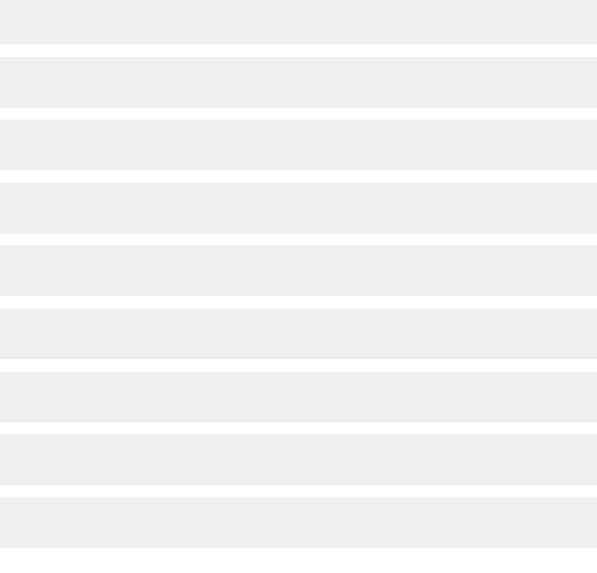
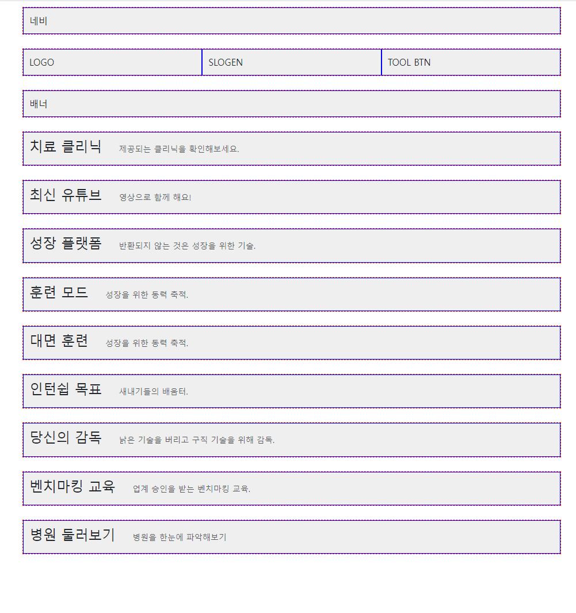

### 1 시멘틱 태그 구조 (34)

1. nav/ header/ section/ footer 태그 + 코멘트 시작/끝 배열 -> section은 종류별로 복사해서 만들기

```html
    <!--메뉴 시작-->
<nav></nav>
<!--메뉴 끝-->
<!--헤더 시작-->
<header></header>
<!--헤더 끝-->
<!--섹션 시작-->
<section></section>
<!--섹션 끝-->
<!--푸터 시작-->
<footer></footer>
<!--푸터 끝-->
```

2. 각 시멘틱 태그에 width100%, 높이100px, 배경#aaa 로 css 주고 시작 -> 각 2번재 태그(header) class="mt-4"로 간격주고 확인하기

```css
nav, header, section, footer {
    width: 100%;
    height: 100px;
    background: #efefef;
}
```

```html
<!--메뉴 시작-->
<nav></nav>
<!--메뉴 끝-->
<!--헤더 시작-->
<header class="mt-4"></header>
<!--헤더 끝-->
<!--섹션 시작-->
<section class="mt-4"></section>
```



3. 확인이 끝났으면 시멘틱 태그의 css 삭제하기

### 2

1. nav태그에 .container>.row>.col을 추가한 뒤, .col css작성해서 확인하기
    - padding 10px를 줘서, 임시로 높이를 만들어 확인한다.

```css
.col {
    border: solid 1px blue;
    background: #EFEFEF;
    padding: 10px;
}
```

2. header태그에 con>row>col3개를 만들고 logo, slogen,tool btn을 배정한다
3. 각 section태그에 con>row>col 1개를 만들고 내용 text로 적어놓는다
    - 제목이 들어가는 곳은 div>h4.d-inline-block+small.text-muted.pl-2를 추가해서 넣어놓는다.
    - **제목+설명을 붙일 때, h4태그는 block이기 때문에 `d-inline-block`을 주고 시작한다.**
    - small태그에 `.ps-5`로 h4태그와 간격을 둔다. (h4태그말고는 작은화면에서 사라질 예정이라서, 자체적으로 여백을 준 듯?)

```html
<!--치료 섹션 시작-->
<section class="mt-4">
    <div class="container">
        <div class="row">
            <div class="col">
                <div>
                    <h4 class="d-inline-block">치료 클리닉</h4>
                    <small class="text-muted ps-4">제공되는 클리닉을 확인해보세요.</small>
                </div>
            </div>
        </div>
    </div>
</section>
<!--치료 섹션 끝-->
```

4. 작성된 section 양식을 복사해서 여러 양식을 만들어놓고, 접어놓는다.

