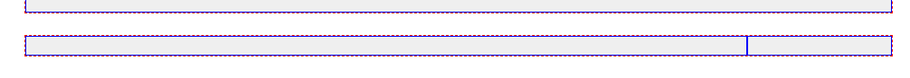

### 1 시멘틱 태그 구조 (34)

1. nav/ header/ section/ footer 태그 + 코멘트 시작/끝 배열 -> section은 종류별로 복사해서 만들기

```html
    <!--메뉴 시작-->
<nav></nav>
<!--메뉴 끝-->
<!--헤더 시작-->
<header></header>
<!--헤더 끝-->
<!--섹션 시작-->
<section></section>
<!--섹션 끝-->
<!--푸터 시작-->
<footer></footer>
<!--푸터 끝-->
```

2. 각 시멘틱 태그에 width100%, 높이100px, 배경#aaa 로 css 주고 시작 -> 각 2번재 태그(header) class="mt-4"로 간격주고 확인하기

```css
nav, header, section, footer {
    width: 100%;
    height: 100px;
    background: #efefef;
}
```

```html
<!--메뉴 시작-->
<nav></nav>
<!--메뉴 끝-->
<!--헤더 시작-->
<header class="mt-4"></header>
<!--헤더 끝-->
<!--섹션 시작-->
<section class="mt-4"></section>
```


3. 확인이 끝났으면 시멘틱 태그의 css 삭제하기

### 2 컨텐츠 구조

1. nav태그에 .container>.row>.col을 추가한 뒤, .col css작성해서 확인하기
    - padding 10px를 줘서, 임시로 높이를 만들어 확인한다.

```css
.col {
    border: solid 1px blue;
    background: #EFEFEF;
    padding: 10px;
}

.row {
   border: dashed 1px red;
   /*margin: 10px 0;*/
}

```

2. header태그에 con>row>col3개를 만들고 logo, slogen,tool btn을 배정한다
3. 각 section태그에 con>row>col 1개를 만들고 내용 text로 적어놓는다
    - 제목이 들어가는 곳은 div>h4.d-inline-block+small.text-muted.pl-2를 추가해서 넣어놓는다.
    - **제목+설명을 붙일 때, h4태그는 block이기 때문에 `d-inline-block`을 주고 시작한다.**
    - small태그에 `.ps-2`로 inline-block이 된 h4태그와 간격을 둔다. (h4태그말고는 작은화면에서 사라질 예정이라서, 자체적으로 여백을 준 듯?)

```html
<!--치료 섹션 시작-->
<section class="mt-4">
    <div class="container">
        <div class="row">
            <div class="col">
                <div>
                    <h4 class="d-inline-block">치료 클리닉</h4>
                    <small class="text-muted ps-2">제공되는 클리닉을 확인해보세요.</small>
                </div>
            </div>
        </div>
    </div>
</section>
<!--치료 섹션 끝-->
```

4. 작성된 section 양식을 복사해서 여러 양식을 만들어놓고, 접어놓는다.


### 3 각 섹션 grid 채우기
#### 치료클리닉
1. `기본+sm`에서는 2x3 카드 `md`부터는 1x6 카드, 제목row 밑에 새로운 row를 추가해서 만든다.
   - **2행3열 이라도, 1행으로 될 가능성이 있으므로, `2행을 col합12+12`로 row추가없이 정의한다.**
   - **3열 -> col-4, col-sm-4 로 6개를 만들어, 2행을 채운다**
   - **일단, 작을때의 모습으로 시작하도록 하며, `추후 1열로 될 size에서는 1row에 일정한 col로 나눠가진다면 auto방식인 col-size`를 사용한다** 
   - `div.col-4.col-sm-4.col-md`
```html
<div class="row">
    <div class="col-4 col-sm-4 col-md"></div>
    <div class="col-4 col-sm-4 col-md"></div>
    <div class="col-4 col-sm-4 col-md"></div>
    <div class="col-4 col-sm-4 col-md"></div>
    <div class="col-4 col-sm-4 col-md"></div>
    <div class="col-4 col-sm-4 col-md"></div>
</div>
```
2. `.col`뿐만 아니라, `사용되는 .col선택자`들 모두 test용 css에 추가해준다.
```css
.col,
.col-4, .col-sm-4, .col-md
{
   border: solid 1px blue;
   background: #EFEFEF;
   padding:10px;
}
```


#### 유튜브 및 공지사항
1. sm일 때, 2x1 공간이며, lg부터 1x2이지만, 8:4로 나눠가져야하므로 col-lg 오토방식이 아니라 직접 비율을 설정해줘야한다
   - sm일때, 1row에 대한 col-12는 줄 필요가 없다. 알아서 기본 col-12다. 위에서는 2행을 만들어야해서 default가 아닌 col-4를 직접 줬었다.
   - div.col-sm-12.col-lg-8
   - div.col-sm-12.col-lg-4
   
2. 사용된 새로운 col도 test css에 준다


#### 성장 플랫폼
1. 같은 열 구조가 아닌 행 -> div.row가 추가되는 복잡한 구조다. but 작을때 클때 구분이 없다.
   - 첫번재 row: 양끝 1| 나머지 | 나머지  -> 넓은col이 있고, 그거와 같은 넓이를 가지는 col로 포함시키는 대칭col이 있다면, 노대칭col + 대칭col auto로 작성한다 
   - 두번째 row: 양끝 1|2|나머지|나머지|2|1
   - 세번째 row : 1개의 col(12지만 그냥 .col)
```html
 <!--성장 섹션 시작-->
 <section class="mt-4">
     <div class="container">
         <div class="row">
             <div class="col">
                 <div>
                     <h4 class="d-inline-block">성장 플랫폼</h4>
                     <small class="text-muted ps-4">반환되지 않는 것은 성장을 위한 기술.</small>
                 </div>
             </div>
         </div>

         <div class="row">
             <div class="col-1"></div>
             <div class="col"></div>
             <div class="col"></div>
         </div>
         <div class="row">
             <div class="col-1"></div>
             <div class="col-2"></div>
             <div class="col"></div>
             <div class="col"></div>
             <div class="col-2"></div>
             <div class="col-1"></div>
         </div>
         <div class="row">
             <div class="col"></div>
         </div>
     </div>
 </section>
 <!--성장 섹션 끝-->
```


#### 훈련모드 & 대면훈련
1. row 1개에 1|3|4|3|1 구조
2. row 1개에 2|2|1|3|4 구조 (나중에 테이블) -> 열 구조가 같지만, 연결되지 않는 별개의 공간 -> 1(thead) + 3(tbody)개 row


#### 목표
1. 2x2 개별 테이블인데, 작은화면에선 모두 1x1 여러줄이다. 내부가 표처럼 복잡하다.
   - 일단 1row씩 나눠서 2x1(sm) -> 1x2(md)로 본다.
   - sm에서 12 -> md에서 6으로 만들어야, 커지면서 묶인다. (한줄이라고 default값 줘버리면, auto로서 나눠가져버리니, -12를 줘야한다. 등간격 auto만 default값으로 두자)
      - 또한, 커졌을 때 1row에 뭉칠 것이 아니라면, row별로 끊어서 봐야한다.
      - **커졌을 때 1row에 뭉쳐지는 것들만 같은row에 배치할 것을 생각하자.**
      - 작앗을 때 1block이면 col-12 -> col-md- 로 줘도 될 것 가지만, 여기서는  col-sm-12를 고집한다. col-12가 안주면, col이 주어지지 않는 구간에선 col-12가 default인가보다?
   - `div.col-sm-12.col-md-6`

2. 1개의 row를 완성했는데, `똑같은 구조가 아래에 존재 & 짝마다 구간마다 합12`로 맞춰진다면, row를 추가하지말고, 자동행변환을 이용해서 col만 추가한다.
```html
<div class="row">
    <div class="col-sm-12 col-md-6"></div>
    <div class="col-sm-12 col-md-6"></div>
    <div class="col-sm-12 col-md-6"></div>
    <div class="col-sm-12 col-md-6"></div>
</div>
```


#### 의료진 소개
1. 위쪽 slider:  col비율 1:3이라 -> col-3 col-9를 하면 되는ㄷ, 뒤쪽은 auto로서 col로만 주면 된다.
2. 아래쪽 카드: sm 이하에선 4x1 -> sm일 땐 2x2 -> lg일 땐, slider + 1x4 다
   - **1열로 결국 뭉처지는 것(1x4)들끼리 row 1개에 여러개를 넣는다.**
   - sm 이하 1열 -> col-12 / sm 2열 -> col-sm-6 / lg 4열 -> col-lg-3
```html
<div class="row">
    <div class="col-3"></div>
    <div class="col"></div>
</div>
<div class="row">
    <div class="col-12 col-sm-6 col-lg-3"></div>
    <div class="col-12 col-sm-6 col-lg-3"></div>
    <div class="col-12 col-sm-6 col-lg-3"></div>
    <div class="col-12 col-sm-6 col-lg-3"></div>
</div>
```


#### 벤치마킹 비교 & 병원 둘러보기
1. 벤치마킹 비교: 테이블형태로 5|2|5 로서, `대칭되는 나머지`인 col-5는 col auto로 줘서 col, col-2, col로 여러개의 row를 만든다.
```html
 <div class="row">
      <div class="col"></div>
      <div class="col-2"></div>
      <div class="col"></div>
  </div>
  <div class="row">
      <div class="col"></div>
      <div class="col-2"></div>
      <div class="col"></div>
  </div>
  <div class="row">
      <div class="col"></div>
      <div class="col-2"></div>
      <div class="col"></div>
  </div>
```
2. 둘러보기: 1row 1col로 한줄만 만들어놓는다


#### footer
1. sm일땐 2x1 -> 커져서는 1row에 1x2(10:2)
```html
<footer class="mt-4">
    <div class="container">
        <div class="row">
            <div class="col-sm-12 col-md-10"></div>
            <div class="col-sm-12 col-md-2"></div>
        </div>
    </div>
</footer>
```


