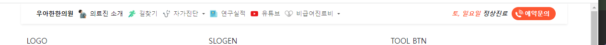

- row/col test css를 삭제한다

### nav 
1. 시멘틱태그 > container > row > col 내부에 bootstrap 기본 nav를 복붙한다
2. nav.navbar에 p-0 or `p-1`를 추가해서 내부공백을 제거해 딱달라붙게 만든다
    - my) navbar-expand-`lg`를 `md`로 고쳐서 md부터 햄버거 없어지게
3. .navbar에 `bg-white`를 추가하고, **navbar가 아닌 `div.col`에 `shadow-sm`을 추가한다**

#### logo 처리 방법
4. .navbar-brand를 a태그로 만들고, 내부에서는 `img.img-fluid`로 이미지를 로고이미지를 넣은 뒤,
    - **img.img-fluid는 한번 넣어보고, `max-width`로 통제한다.**
    - custom css .logo를 만들어 -> `.logo img{}`에 되고, inline으로 줘도 된다.
```html
<a class="navbar-brand" href="#">
   
</a>
```
5. **이제 `a.navbar-brand`에 `navbar-toggler`를 추가하면, 햄버거는 아니지만, sm에서만 나타나게 된다.**
   - **이 때, border까지 같이 생기니 `border-0`도 필수로 추가한다**
```html
<a class="navbar-brand navbar-toggler border-0" href="#">
   
</a>
```
#### nav 글자 스타일
1. 네비에 있는 item들 및, dropdown에 있는 글자들의 글자체를 일괄로 줄이기 위해 path를 잡아 font-size를 small로 준다
```css
#navbarSupportedContent > ul > li >a,
nav .dropdown-menu > li > a {
   font-size: small;
}
```
2. 네비에 있는 것들을 클릭(focus), hover시 진하게 하여 생동감을 준다
   - font-size가 정해짐에 따라, 글자크기를 키움을 추가해서, 애니메이션효과도
```css
#navbarSupportedContent > ul > li > a:hover,
#navbarSupportedContent > ul > li > a:focus
{
   font-weight: bold;
   font-size: 0.9em;
}
```
3. disabled를 이용해서, 고정된 텍스트 만들기
   - 주요색상은 :root에 작성하고, css 정의시 var()로 준다
   ```css
   :root{
      --text-main: #FC5230;
   }
   .text-main {
      color: var(--text-main);
   }
   .bg-main {
      background-color: var(--color-main);
   }
   ```
```html
<li class="nav-item ">
         <a class="nav-link disabled fst-italic fw-bold text-dark " href="#" tabindex="-1"
            aria-disabled="true">
             <span class="text-main">토/일요일</span> 정상진료
         </a>
     </li>
 </ul>
```

4. max-md 사이즈에선 햄버거메뉴에서 글자크기를 복구한다
- max-md 사이즈 햄버그메뉴에서 focus/hover시에도 준다
   ```css
     @media screen and (max-width: 768px){
         #navbarSupportedContent > ul > li > a,
         nav .dropdown-menu > li > a {
             font-size: 1em;
             margin: 2px 0;
         }
  
         #navbarSupportedContent > ul > li > a:hover,
         #navbarSupportedContent > ul > li > a:focus {
             font-size: 1em;
             font-weight: bold;
         }

         .fs-13 {
             font-size: 1em;
         }
     }
   ```

#### nav의 각 li.nav-item 속 a태그에 icon을 background로 달기

1. 전략은 **각 li.nav-item 속 `a.nav-link`태그에 `style=""`로 `배경이미지;no-repeat`로 집어넣되, 가로 세로위치를 `0 center`로 줘서, 왼쪽/수직가운데 정렬시켜서 시작하게 한다**
   - **또한, 이미지가 클 경우를 대비해 선택적으로 `background-size:contain;`를 추가해서, 해당 이미지를 `원본 비율을 유지하면서 배경 영역에 꽉 차게 맞추는 속성`을 적용하고**
   - **필수로 `padding-left: 25px`를 이용하여 `icon이미지의 width`를 포함하여 약간의 여백을 추가해서 준다**
   - 즉, 왼쪽부터 시작하는 배경이미지를, 글자앞에 padding공간을 만들어서 집어넣는다.
   - **이 때, `py-0`을 줘서, 글자와 높이를 같게 맞춰야한다.**
   - 이미지는 위아래 여백이 조금 있는 18x18px을 준비하면 좋다.
```html
<li class="nav-item">
   <a class="nav-link active py-0 my-1 my-md-0" href="#"
      style="background: url('images/icons/crown.png') no-repeat 0 center; background-size:contain; padding-left: 25px"
   >
       홈
   </a>
</li>
```

#### md까지는 안넘치도록, 뒤쪽 비우선순위는 중간에 안보이게 하기
1. 앞에 메뉴4개(홈, 의료진소개, 길찾기, 자가진단)는 햄버거, md부터 다 보이도록 하고
2. **그 이후메뉴는 md부터 나타나도록 하고 싶었지만, `d-none d-md-block`을 주면, `햄버거에서도 안보이는 문제`가 발생하며, 추가적으로 `애매한 md일때 나타났는데 넘쳐버림`의 문제가 있다.**
   - **애초에 햄버거에서 보이도록 출발해야하고**
   - **어중간한 sm, md에서는 안보이도록 `d-sm-none`을 주고, lg부터 나타나게 `d-lg-blcok`을 주었다.**
   - 전체 등장 -> sm ~ md: 불필요메뉴 none -> lg: 전체 등장
3. 햄버거가 사라지는 md 이전, 처음~sm~ 까지는 my-1로 줘야 메뉴들이 간격을 가진다.
   - **즉, `my-1 my-md-0`도 추가한다**
   
```html
<ul class="navbar-nav me-auto mb-lg-0">
   <li class="nav-item">
      <a class="nav-link active py-0 my-1 my-md-0" href="#"
         style="background: url('images/icons/crown.png') no-repeat 0 center; background-size:contain; padding-left: 25px"
      >
         항시 메뉴
      </a>
   </li>
   <li class="nav-item d-sm-none d-lg-block">
      <a class="nav-link py-0 my-1 my-md-0" href="#"
         style="background: url('images/icons/report.png') no-repeat 0 center; background-size:contain; padding-left: 25px"
      >
         햄버거 등장 ~ sm부터 사라졌다가 ~ lg 등장메뉴
      </a>
   </li>
</ul>
```

#### nav 속 ul.navbar-nav의 me-auto에 의해 오른쪽 정렬되는 메뉴 2개
1. 2개의 메뉴를 감싸기 위해 `div.d-flex`에 감싸고, 각각을 수직정렬하기 위해서는 `align-items-center`가 들어가
2. 각각을 a태그로 만드는데 스타일 지정등을 간소화하기 위해 nav안이므로 `a.nav-link` 활용한다
   - 각각에 아이콘을 입히고 싶으면 입힌다

```html
 <!--justify-content-center justify-content-md-end 넣으면, 햄버거에서 가운데 정렬-->
 <div class="d-flex align-items-center fs-13 fw-bold">
     <a class="nav-link disabled d-sm-none d-lg-block fst-italic text-dark me-2 "
        href="#"
     >
         <span class="text-main ">토, 일요일</span> 정상진료
     </a>

     <div class="p-1 px-2 rounded-pill bg-main text-white">
         <a class="nav-link py-0 pe-1 my-1 my-md-0" href="tel:02-4600-6243"
            style="background: url('images/icons/call.png') no-repeat 0 center; padding-left: 20px;"
            >
             예약문의
         </a>
     </div>
 </div>
```



