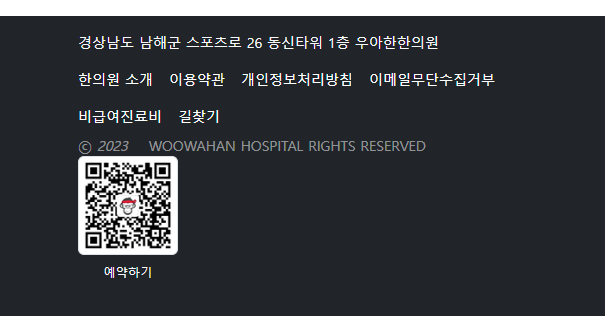
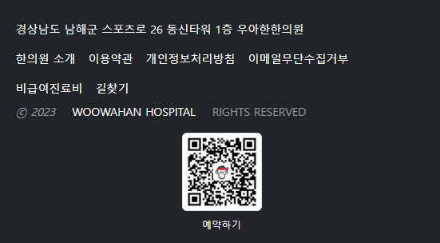

- footer는
- 12/12 -> 10/2 에서  10공간에 p태그로 1줄 + li로 여러 단어 나열을 할 것이며, 2공간에서는 qr태그를 놔둘 것이다


1. `.container` 바깥의 `semantic태그`인 footer에 bg-dark, text-light, small을 줘서, 바로 안쪽 컨테이너도 포함하여 전체가 색깔을 먹게한다
2. col안에 텍스트를 배치하기 전에 **내부 여백 등을 조절할 `빈div`**를 먼저 씌우고 작성하낟
   - 1줄 : p태그 / **가로 링크 나열 -> `ul.nav` > `li.nav-item` > `a.nav-link`를 활용한다**
   - 각 a태그는 nav-link를 통해 style은 수정되나 색깔은 파란색 유지 -> `text-white`를 준다
   - flex + flex-wrap: wrap; 적용상태라, 넘어가면 다음줄로 넘어가게 된다.
```html
<!--푸터 시작-->
<footer class="mt-4 bg-dark text-light small">
    <div class="container">
        <div class="row">
            <div class="col-sm-12 col-md-10">
                <div>
                    <p>경상남도 남해군 스포츠로 26 동신타워 1층 우아한한의원</p>
                    <ul class="nav">
                        <li class="nav-item"><a href="#" class="nav-link text-white">한의원 소개</a></li>
                        <li class="nav-item"><a href="#" class="nav-link text-white">이용약관</a></li>
                        <li class="nav-item"><a href="#" class="nav-link text-white">개인정보처리방침</a></li>
                        <li class="nav-item"><a href="#" class="nav-link text-white">이메일무단수집거부</a></li>
                        <li class="nav-item"><a href="#" class="nav-link text-white">비급여진료비</a></li>
                        <li class="nav-item"><a href="#" class="nav-link text-white">길찾기</a></li>
                    </ul>
                </div>
            </div>
            <div class="col-sm-12 col-md-2">
            </div>
        </div>
    </div>
</footer>
``` 
3. 아래 1줄이 더있는데, a태그를 내포 및 세부설정도 해줘야한다면, -> div로 주고, i/span 등으로 내부에서 지정해준다
    - 중간에 여백을 주기 위해서 span.mx-3 등으로 span을 활용한다
    - div안 글자속의 a태그는 또한번 .text-decoration-none 이후 다시 한번 색을 줘야한다
```html
<div class="text-white-50">
    ⓒ <i>2023</i> <span class="ms-3"> <a href="#" class="text-decoration-none text-white-50">WOOWAHAN HOSPITAL</a> RIGHTS RESERVED </span>
</div>
```
4. 이제 전체여백은 `row에 pt, pb`를 / 줄간격은 `p  ul  div 사이에 mt,mb`을 활용한다 
```html
<div class="row pt-3 pb-5">

    <p class="mb-2">경상남도 남해군 스포츠로 26 동신타워 1층 우아한한의원</p>

```

5. ul.nav로 만들 때, 양옆의 padding은 개별 li 들에서 `ps-0`으로 왼쪽여백만 삭제해준다
```html
<li class="nav-item"><a href="#" class="nav-link text-white ps-0">한의원 소개</a></li>
```

6. 이제 우측 qrcode를 caption과 같이 넣기 위해서, `figure.figure` > `img.figure-img.img-thumbnail` & max-width:본래width px + `figcaption.figure-caption` & text-center & text-light 을 활용한다
    - .figure를 통해, block인 figure를 img태그처럼, 부모를 inline으로 만들고
    - .figure-img를 통해, img태그와 caption사이 여백을 주고
    - .img-thumbnail로,  img-fluid와 같은 효과(max-width100% height auto)를 낸다
       - **하지만 무한대로 커지지 않게 하기 위해, max-width를 그림크기인 100px로 고정한다** 
    - .figure-caption을 통해, block은 유지되지만, 글자크기+색을 caption용으로 변경하며
    - .text-center로 figcaption자체는 block이지만, inline자식용(content, text) 가운데 정렬을 시킨다.
    - .text-light로 밝은 색?을 가져간다
    
7. 접혔을 때, 다음줄 처리를 한다.
   - qrcode를 가운데 놓기 위해 `div.col 부분에 text-center`하되, md부터는 `text-md-end`하고 패딩은 0로 준다 (figure.figure는 inline -> 부모에서 text-center)

```html
<div class="col-sm-12 col-md-2 text-center text-md-end p-0">
    <figure class="figure">
        
        <figcaption class="figure-caption text-center text-light"> 예약하기 </figcaption>
    </figure>
</div>
```
8. 이제 row에서 pt-3을 주 것과 별개로, p/ul를 담고 있는 빈div에서 pt을 줘서,  자체적으로 글부분만 띄운다
```html
<div class="pt-4">
   <p class="mb-2">경상남도 남해군 스포츠로 26 동신타워 1층 우아한한의원</p>
   <ul class="nav">
```
9. qrcode figure부분에서는 mt-3으로 위족과 거리를 준다
```html
<figure class="figure mt-3">
```


