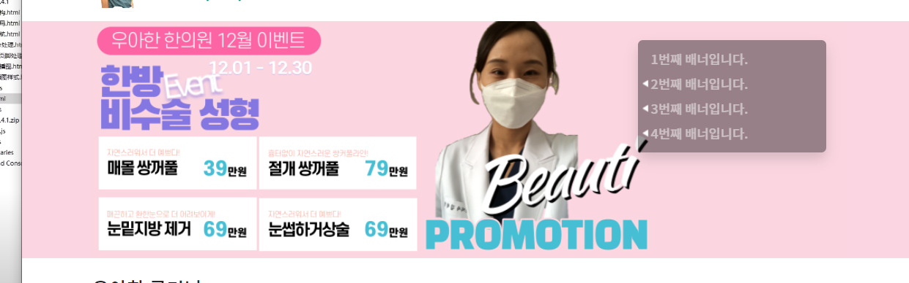

### mobile banner - bootstrap carousel + 951x370 px 
1. bootstrap caption잇는 예제를 들고온다
2. 추가해서 6개의 배너로 미리 만든다
- data-bs-slide-to="5" 숫자 0부터 수정
3. div.carousel에 `data-bs-ride="carousel"` 옵션을 줘야 자동으로 autoplay된다.
4. div.carouse.slide에 `.carousel-fade`를 추가하면 애니메이션으로 사라진다
5. **이미지는 `951x370 px`을 맞춰야 높이변화가 없을 것이다.**
5. section의 mt-4를 mt-1로 줄이자
6. **lg부터는 안보여야하는 모바일전용이므로 `section태그에 d-lg-none`을 추가한다**


### PC banner 배경 및 caption 작성
1. mobile과 동일한 mt-x를 가진 secion을 새롭게 생성하여 새롭게 만든다
```html
<!-- PC 배너 섹션 시작-->
<section class="mt-1 ">
 <div class="container">
     <div class="row">
         <div class="col">
         </div>
     </div>
 </div>
</section>
<!-- PC 배너 섹션 끝 -->
```

2. col안에 빈div > a태그 > img를 1개 배치한다
- target="_blank"
- **이 때 특이한 점은 `img.w-100.d-block`으로 inline인 img태그를 block으로 만든다**
```html
<div class="col">
 <div>
     <a href="#" target="_blank">
         
     </a>
     <a href="#" target="_blank">
         
     </a>
     <a href="#" target="_blank">
         
     </a>
     <a href="#" target="_blank">
         
     </a>
     <a href="#" target="_blank">
         
     </a>
     <a href="#" target="_blank">
         
     </a>
 </div>
</div>
```

3. 빈 div에 `carousel`을 > a태그에 `carousel-item`을( 첫번째만 `active`)을 줘서 이미지6개가 1개로 보이게 한다
```html
<!-- PC 배너 섹션 시작-->
<section class="mt-1 ">
 <div class="container">
     <div class="row">
         <div class="col">
             <div class="carousel">
                 <a class="carousel-item active" href="#" target="_blank">
                     
                 </a>
```

4. section태그 자체에 style로 첫번째 보이는 배너의 배경색을 지정해서 전체로 넓어지는지 보자


5. 이제 list-group을 씌우는 card를 우측정렬하고, 25%만 차지하는 div.card 만들기 위해 col내부에서 `div.card.w-25.ms-auto.shadow`를 만들고 내부에 `div.list-group`을 생성한다
- div.list-group내부에는 `a.list-group-item`들로 채운다
```html
<div class="card w-25 ms-auto shadow">
 <div class="list-group">
     <a href="#" class="list-group-item">1번째 배너입니다.</a>
     <a href="#" class="list-group-item">2번째 배너입니다.</a>
     <a href="#" class="list-group-item">3번째 배너입니다.</a>
     <a href="#" class="list-group-item">4번째 배너입니다.</a>
     <a href="#" class="list-group-item">5번째 배너입니다.</a>
     <a href="#" class="list-group-item">6번째 배너입니다.</a>
 </div>
</div>
```


6. div.card의 배경을 style로 `rgba(0,0,0, 0.4)`의 반투명 검은색 배경을 주고, list-group-item들의 간격을 `lh`로 준다.
- `style="background-color: rgba(0,0,0, 0.4);line-height: 20px;"`
7. div.list-group에 `list-group-flush`를 추가하여 바깥 border를 제거한다
8. **각 a.list-group-item의 배경을 `bg-transparent`로 주고, 사이 border를 `border-0`로 제거한 뒤, 글자색을 `text-white-50`로 회색으로 준다**
9. div.card에 `mt-4`를 추가해서 약간의 간격을 벌리고, `border-0`를 추가해서 card자체의 border도 제거하고, `py-2`로 내부 애들의 상하여백을 준다 
10. 화면을 줄일 때 넘치는 것을 제거하기 위해 각 a.list-group-item에 `text-truncate` 추가
11. 이제 section태그에 d-none 시작, d-lg-block 으로 lg일때만 보이게 한다

### PC carousel jquery로 넘어가게 하기
1. boostrap.js 전에 추가하기
```html
<!--임시 jquery: boostrap 전에 추가-->
<script src="https://ajax.aspnetcdn.com/ajax/jquery/jquery-1.9.0.js"></script>

<script src="js/bootstrap.bundle.js"></script>
```
2. div.carousel에 `id="carouselMainPc"`를 추가하기
```html
<div class="carousel" id="carouselMainPc" >
```
3. jquery 실행함수 안에서 a태그의 갯수 가져오기
```html
<!--index.html 전용: jquery(carouselMainPc) 설정-->
<script>
 $(function () {
     var sum = $('#carouselMainPc a').length;
     console.log(sum)

 })
</script>
```
4. prtimer를 4초마다 순회하면서 sum만큼 순회한 뒤, 0으로 초기화해서 계속 돌도록 짜고, 실행시키기
```html
<script>
 $(function () {
     var sum = $('#carouselMainPc>a').length;
     // console.log(sum)
     var ptimer = null;
     var i = 0;

     function runCarouselMainPc() {
         ptimer = setInterval(function () {
             i++;

             if (i === sum) {
                 i = 0;
             }
             console.log(i)
         }, 4000);
     };

     runCarouselMainPc();
 })
</script>
```
5. 이제 4초마다 작업시킬 runCarousel 메서드 짜기
- i번째 a태그는 나타나고, 그외 형제들은 사라지도록 짠다.
- banner그림들은 순회가 제대로 된다.
```js
function runCarousel() {
 // i번째는 나타나고, 나머지는 사라지도록
 $('#carouselMainPc>a').eq(i).fadeIn().siblings().fadeOut();
}

function runCarouselMainPc() {
 ptimer = setInterval(function () {
     i++;

     if (i === sum) {
         i = 0;
     }
     // console.log(i)
     runCarousel();
 }, 4000);
}
```
6. 각 `a태그마다` 배경색을 전달받기 위해 `data-color 속성` 선언하여 받아 -> `id지정하여 section태그`의 배경에 지정하기
- 배경을 받을 section에 id를 부여
```html
<!--<section class="mt-1 d-none d-lg-block" style="background-color: #160A39">-->
<section class="mt-1 d-none d-lg-block"  id="carouselMainPcSection">
```
- 테스트를 위해 setInterval 2초로 변경
- fadeOut시, 0.9초 있다가 다음 배경 반영하기?!
```js
function runCarousel() {
   // 2. a태그에서 data-color속성의 값 받아오기
   var bgColor = $('#carouselMainPc>a').eq(i).attr('data-color');
   // console.log(bgColor)

   // 1. i번째는 나타나고, 나머지는 사라지도록
   // $('#carouselMainPc>a').eq(i).fadeIn().siblings().fadeOut();
   $('#carouselMainPc>a').eq(i).fadeIn().siblings().fadeOut(900, function () {
       //3. 받아온 bgColor를 section#id 로 지정해주기
       $('#carouselMainPcSection').css('backgroundColor', bgColor);
   });
}
```

7. **setInterval 초기화에 대비하여** 초기 0번째 배경 반영 미리 반영
```js
var bgColor = $('#carouselMainPc>a').eq(0).attr('data-color');
$('#carouselMainPcSection').css('backgroundColor', bgColor);
runCarouselMainPc();
```
8. a태그에 hover를 걸고, clearInterval()로 순회를 멈춰놓는 로직을 구현한다. hover가 끝난 후에는 다시 ptimer로 작동할 것이다.
```js
// 5. a태그에 hover걸어서, 현재 pause time상태로 멈추고, hover 종료시 재실행
$('#carouselMainPc>a').hover(function () {
 clearInterval(ptimer)
 console.log('hover')
// 정지시 로직

}, function () {
 console.log('hover 종료후 재실행')
 runCarouselMainPc();
})

function runCarouselMainPc() {
 // 6. hover후 재실행될 때, 현재 기억된 ptimer로 정지해놓고, 재실행되면, 그것 기준으로 실행되게 하기
 clearInterval(ptimer);
```

### PC carousel list-group과 연계시키기
1. bg로 icon을 집어넣을 하얀색 화살표 icon 이미지를 준비해놓고, 
2. section태그 위쪽에 style태그로 css를 지정해준다
- select시 css배경으로 icon -> 선택안될시에도 만들어줘야한다
```html
<!-- PC 배너 섹션 시작-->
<style>
 .z-select {
     background: transparent url('images/icons/banner_select.png') no-repeat 4px center;
 }

 .z-not-select {
     color: #aaa;
 }
</style>
<section class="mt-1 d-none d-lg-block" id="carouselMainPcSection">
```
3. a태그 형제를 모두 적용하기 위해, 부모인 `div.list-group`에 id를 지정해준다.

```html
<div class="list-group list-group-flush" id="bannerCaptionList">
```
4. 캐러셀에서 그림이 바뀔때, i번째 a태그에 대해, `z-select`css를 addClass를 통해 추가해서 확인해본다


5. 문제점: icon과 가까워서 -> a태그에 앞쪽 여백 추가 + 글자크기 작게 수정 `ps-4 fs-13` / **첫번째 화살표가 먼저 나오진 않고 있음.**
```html
<a href="#" class="list-group-item bg-transparent border-0 text-white-50 text-truncate ps-4 fs-13">1번째
    배너입니다.</a>
```

6. 이제 해당되는 a태그에서 기존 글자색 `text-white-50`을 제거하고, 나머지 친구들은 기존글자색 추가하고, `text-white z-select`는 제거한다
```js
$('#bannerCaptionList>a').eq(i).addClass('z-select text-white').removeClass('text-white-50').siblings().addClass('text-white-50 z-not-select').removeClass('z-select text-white');
```

7. 첫번째는 초기화시 지정되도록 한다
```js
// 4. 배경 초기화
var bgColor = $('#carouselMainPc>a').eq(0).attr('data-color');
$('#carouselMainPcSection').css('backgroundColor', bgColor);
// 8. caption select 초기화
$('#bannerCaptionList>a').eq(0).addClass('z-select text-white').removeClass('text-white-50');

runCarouselMainPc();
```

8. 이제 각 a태그에 mouseover/mouseout을 걸어, 해당 배너로 이동하도록event를 걸어야하는데, 우선 글자색부터 바뀌게 걸어보자.
    - 이 때, 해당 텍스트 변경 css가 !important가 들어가있어야한다.
```css
.text-main {
    color: var(--color-main) !important;
}
```

```js
// 4. 배경 초기화
var bgColor = $('#carouselMainPc>a').eq(0).attr('data-color');
$('#carouselMainPcSection').css('backgroundColor', bgColor);
// 8. caption select 초기화
$('#bannerCaptionList>a').eq(0).addClass('z-select text-white').removeClass('text-white-50');

runCarouselMainPc();

// 9. banner caption에 mouseover/out 이벤트 걸기
$('#bannerCaptionList>a').mouseover(function () {
    $(this).addClass('text-main');
}).mouseout(function () {
    $(this).removeClass('text-main');
})
```


9. 이제 `$(this).index()`를 이용해서 carousel 작동순서인 `i`에 재할당하여, 컨텐츠를 보여주게 한다. 마우스를 떼면, 처음부터 시작을 해도, i가 바뀌어서 실행된다.
```js
// 9. banner caption에 mouseover/out 이벤트 걸기
$('#bannerCaptionList>a').mouseover(function () {
   // 글자색 변경!important
   $(this).addClass('text-main');
   // carousel 멈춤
   clearInterval(ptimer);
   // 현재놈의 인덱스를 전역변수 i에 재할당 -> 내부실행 재시작
   i = $(this).index();
   runCarousel();

}).mouseout(function () {
   $(this).removeClass('text-main');
   // 마우스를 떼는 순간, 처음부터 재시작하면, 바뀐 i서부터 시작
   runCarouselMainPc();
})
```
10. 현재의 문제점: 마우스를 빠르게 변경하여도 비동기로서, 실시간이 아닌 전부다 바뀌고 나서 돌아온다.
   - **글자색바뀜 이후에 setTimeout을 걸어서, 1회성으로 0.5초이후 실행되게 하고, 그 이전에 mouseout되었다면, clearTimeout으로 취소시킨다**
   - setTimeout시 반환되는 htimer를 가변변수에 저장해놓고, 취소시 활용한다. 
   - **이 때, $(this)는 더 깊숙한 함수에서 못사용하므로, 미리 변수로 빼두고 써야한다.**
```js
let htimer = null;
// 9. banner caption에 mouseover/out 이벤트 걸기
$('#bannerCaptionList>a').mouseover(function () {
    // 글자색 변경!important
    $(this).addClass('text-main');

    // 10. 멈추고 순서를 바꾸는 것에 0.5초 딜레를 주고, 그 전에 mouseout되면 취소됨.
    let current_obj = $(this);
    htimer = setTimeout(function () { // carousel 멈춤
        clearInterval(ptimer);
        // 현재놈의 인덱스를 전역변수 i에 재할당 -> 내부실행 재시작
        i = current_obj.index();
        runCarousel();
    }, 500)

}).mouseout(function () {
    $(this).removeClass('text-main');

    // 마우스를 떼는 순간, 처음부터 재시작하면, 바뀐 i서부터 시작
    // 11. htimer시간이 아직 안지났으면 그 작업이 취소
    clearTimeout(htimer);

    runCarouselMainPc();
})
```


11. 이제 다시 자동으로 흘러가는 시간을 4초 or 5초로 변경한다
