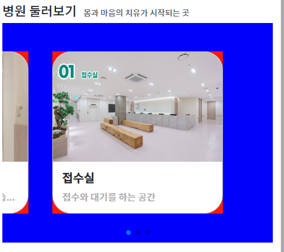

### 모바일 버전 swiper + custom
1. card-img-top을 가진 card를 만들어,`col`에 집어넣는다.
```html
<div class="row">
    <div class="col">
        <div class="card border-dark-subtle border-1 rounded-5 h-100" >
            
            <div class="card-body  text-start">
                <h5 class=" card-title fw-bold">접수실</h5>
                <p class=" card-text text-truncate fw-lighter" style="color: darkgray">접수와 대기를 하는 공간</p>
            </div>
        </div>
    </div>
</div>
```
2. swiperjs.com > docs > get started 에서 CDN 코드를 가져와 추가한다
   - css / js
```html
 <!-- index.html 전용 swiperjs css (병원 둘러보기) -->
 <link
         rel="stylesheet"
         href="https://cdn.jsdelivr.net/npm/swiper@9/swiper-bundle.min.css"
 />
```
```js
<!--swiper js-->
<script src="https://cdn.jsdelivr.net/npm/swiper@9/swiper-bundle.min.js"></script>
```
3. swiperjs.com > resources > demos 에서 `loop infinite`의 core 예제코드에서 body태그 속의 html코드 -> col 속으로 +  Initialize Swiper 코드를 가져와
   - slide 1개만 남기고, next/prev버튼 div코드도 삭제한다
   - `mySwiper` 선택자를 `facilitySwiper`로 변경하고, 초기화코드에서도 변경해준다.
   - card를 `div.swiper-slide` 속으로 넣어준다.
   - 초기화코드에서 navigation 설정을 삭제한다
```html
<div class="row ">
    <div class="col">
        <!-- Swiper -->
        <div class="swiper facilitySwiper">
            <div class="swiper-wrapper">
                <!-- slide -->
                <div class="swiper-slide">
                    <div class="card border-dark-subtle border-1 rounded-5 h-100">
                        
                        <div class="card-body  text-start">
                            <h5 class=" card-title fw-bold">접수실</h5>
                            <p class=" card-text text-truncate" style="color: darkgray">접수와 대기를 하는 공간</p>
                        </div>
                    </div>
                </div>
            </div>

            <div class="swiper-pagination"></div>

        </div>
    </div>
</div>
```
```js
 var swiper = new Swiper(".facilitySwiper", {
     slidesPerView: 1,
     spaceBetween: 30,
     loop: true,
     pagination: {
         el: ".swiper-pagination",
         clickable: true,
     },
 });
```
4. `div.swiper-slide > div.card`를 복사해서 여러개 slide로 만들어, 페이지네이션 버튼과 돌아가는 것을 확인한다.
5. **container 역할인 `.swiper`가 있는 `.facilitySwiper`에서 max-width를 지정해 한없이 안커지게 한다**
   - height는 width에 의해 auto로 지정되므로 **height가 한없이 안커지도록 width를 정하는 것**
   - lg까지의 크기(576 / 768 / `992` )만 커지도록 해서 height도 적당히 커지게 한다
   - **화면보다 작아질 때는, 가운데 정렬을 해야하지만, .swiper내부에서 mx-auto가 적용되어있다**
   - 크기확인을 위해 bgc고 같이 임시로 준다
```html
<style>
    .facilitySwiper {
        max-width: 992px;
       /*test*/
        background-color: blue;
    }
</style>
```
6. slide들을 flex로 만들어주는 `.swiper-warpper`에서는 수직정렬만 추가해준다.
```css
    /* flex wrapper */
.facilitySwiper .swiper-wrapper {
   align-items: center;
}
```
7. 개별 slide들의 공간인 `.swiper-slide`를 .swiper(.facilitySwiper)보다 작게 max-width를 지정해준다. 이미지에 맞게 조절한다
```css
 /* 1개 slide */
.facilitySwiper .swiper-slide {
     max-width: 290px;
     /*test*/
     background-color: red;
 }
```
8. 여러개의 slide가 같이 보여질 수 있게 swiper 설정을 수정해준다.
   - slidesPerView: 1->'auto'
   - centeredSlides: true 추가 (auto설정 필수)
   - spaceBetween: 30 -> 60
   - grabCursor: true 추가
```js
var swiper = new Swiper(".facilitySwiper", {
  // slidesPerView: 1,
  slidesPerView: 'auto',
  // 추가1
  centeredSlides: true,
  // spaceBetween: 30,
  spaceBetween: 60,
  // 추가2
  grabCursor: true,

  loop: true,
  pagination: {
      el: ".swiper-pagination",
      clickable: true,
  },
});
```
9. 이제 center에 있는 slide를 확대할 건데, **overflow:hidden이지만, 받아줄 공간을 `.facilitySwiper(.swiper)`에서 padding으로 만들어준다.**
```html
<div class="swiper facilitySwiper p-5">
```


10. 이제 가운데로 온 slide에 생기는 선택자인 `.swiper-slide-active`에 대해 내부 card의 크기를 확대시켜준다.

```css
 /*active slide*/
.facilitySwiper .swiper-slide-active .card {
   transform: scale(1.2);
   transition: .4s;
}
```

11. card 확장(img + text)시 글자도 커지므로, 글자는 20%키운맞큼 20% 축소시켜준다
```css
 .facilitySwiper .swiper-slide-active .card .card-body {
     transform: scale(0.833333); /* 1 / 1.2 = 0.833333 */
     transition: inherit;
 }
```
12. 이제 페이지네이션을 .swiper 공간 아래로 붙혀주고, 색깔도 바꿔준다.
   - 위치는 `.swiper-pagination{}`내부에서 bottom위치를 정해주되 `!important`해야함
   - 색은 `.swiper-pagination-bullet{}`에서 bgc로 지정해줘야한다
```css
 .facilitySwiper .swiper-pagination {
     bottom: 0!important;
 }
 .facilitySwiper .swiper-pagination-bullet{
     background-color: var(--color-submain);
 }
```


13. test 배경색을 삭제해준다

14. 버그 수정
   - **3개가 보이는 상황에서 무한루프를 돌리려면 `4개 이상의 slide`가 배치되어야 버그가 안난다.**
   - **small이하 화면에서는 1개만 보이므로 확대는 안하도록 `sm이상(576)에서만 확대`**하도록 수정한다
      - 확인결과 **576보다 높은 곳에서 확대해야 깔끔하게 연결된다. -> +200한 `768`에서 처리하도록**
   ```css
   @media screen and (min-width: 768px) {
       /*active slide*/
       .facilitySwiper .swiper-slide-active .card{
           transform: scale(1.2);
           transition: .4s;
       }
       .facilitySwiper .swiper-slide-active .card .card-body {
           transform: scale(0.833333); /* 1 / 1.2 = 0.833333 */
           transition: inherit;
       }
   }
   ```
   - **또한, div.swiper에서도 padding을 pagination을 위한 `pb-4`만 설정해놓고, `sm이상 확대시에만 p-5`가 적용되도록 수정한다.**
      - 또한, 확대되면서 max-width도 커져야한다.
   ```html
   <div class="swiper facilitySwiper pb-4">
   ```
   ```css
   @media screen and (min-width: 768px) {
      .facilitySwiper {
         padding: 4rem !important;
      }
   
      .facilitySwiper .swiper-slide {
         max-width: 400px;
      }
   }
   ```
   - **또한, breakpoint마다 spacebetween이 달라야한다. 확대적용되는 576+200 (`768`)이상부터 30 -> 90으로 준다**

```html
<script>
    var swiper = new Swiper(".facilitySwiper", {
        // slidesPerView: 3,
        slidesPerView: 'auto',
        // 추가1
        centeredSlides: true,
        spaceBetween: 30,
        breakpoints: {
            768: {
                spaceBetween: 90
            }
        },
        // 추가2
        grabCursor: true,

        loop: true,
        pagination: {
            el: ".swiper-pagination",
            clickable: true,
        },
    });
</script>
```

15. 글자크기는 확실히 확대되기전에는 md(max 768)에서 줄어들어야한다
   - 한번에 수정하기 위해 card-body만 타겟팅해서 축소시킨다
```css
    /* 확대 전까지는, 평소보다 글자 80% 작게 */
    @media screen and (max-width: 768px) {
        .facilitySwiper .card .card-body {
            transform: scale(0.833333);
            transition: inherit;
        }
    }

```

16. pc용 따로 없이 max-width를 container 넓이인 1320px까지 넓히도록 설정한다
```css
/* swiper 전체 공간 */
.facilitySwiper {
   /*max-width: 992px;*/
   max-width: 1320px;
}
```
