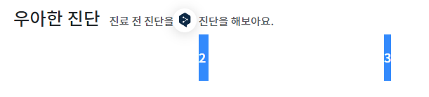
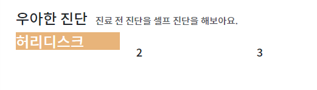
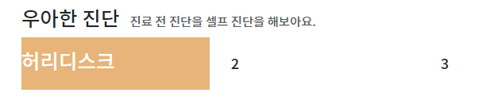
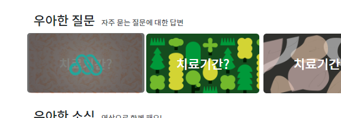
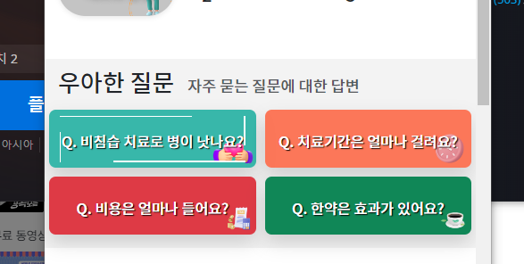

1. row 속에 `col-4 col-md-4 col-lg`를 이용하여 작은화면3, 큰화면 auto로 다들어가게 하며, **style로 height를 미리 fix한다**
    - **이 때, `높이가 정해진 no flex(col) 텍스트 수직 가운데 정렬`은 `높이와 동일한 line-height`를 주면 된다.**
```html
<div class="row">
    <div class="col-4 col-md-4 col-lg " style="height: 60px;line-height: 60px;">
    </div>
</div>
```

2. 내부 text를 쓸 땐 `빈div`안에서 > `a.text-decoration-none.글자색` > `h태그`로 쓴다.
```html
<div class="col-4 col-md-4 col-lg " style="height: 60px;line-height: 60px;">
   <div>
      <a href="#" class="text-decoration-none text-white">
         <h4>허리디스크</h4>
      </a>
   </div>
</div>
```
3. **`빈div`에다가 style=로  `배경을 삽입`한다.**
```html
 <div style="background-color: #E7B277;">
     <a href="#" class="text-decoration-none text-white">
         <h4>허리디스크</h4>
     </a>
 </div>
```

4. **inline인 `a태그`를, `높이 및 width가 정해진 부모 내부에서 꽉 차지하게하려면`, `d-inline-block`을 주면, 한줄표시 + width를 다 먹게되고, 부모의 width를 쫓아간다**
```html
<div class="col-4 col-md-4 col-lg " style="height: 60px;line-height: 60px;">
    <div style="background-color: #E7B277;">
        <a href="#" class="d-inline-block text-decoration-none text-white">
            <h4>허리디스크</h4>
        </a>
    </div>
</div>
```


5. 이제 a를감싸는 div를 **`높이/너비가 정해진 col`에 가득채우기 위해, `w-100, h-100`을** 주고, `text-center`까지 준다
```html

<div class="w-100 h-100 text-center"
     style="background-color: #E7B277;">
    <a href="#" class="d-inline-block text-decoration-none text-white">
        <h4>허리디스크</h4>
    </a>
</div>
```


6. 이제 가로길이는 신경안써도 되는, col 높이 120px의 패턴그림을 배경으로 지정한다. rounded 까지 div에 추가한다
   - 높이만 맞추고, 반복 position size는 신경안쓴다
```html
<div class="w-100 h-100 text-center rounded"
     style="background: url('images/patterns/001.png');">
   <a href="#" class="d-inline-block text-decoration-none text-white">
      <h4>치료기간?</h4>
   </a>
</div>
```

7. 이제 6개를 복붙한 다음, 레이아웃을 보고 **w-100, h-100중인 div말고 `col에서 p`를 줘서 `내부요소 크기를 조절`한다**
```html
<div class="col-4 col-md-4 col-lg p-1 " style="height: 120px;line-height: 120px;">
```


### css으로 1줄에 col 6개 모인 고정크기시에만  hover효과 내기
1. `contain` 선택자를 `모든 col의 부모선택자로서 row`에 달게하고
2. a태그 내부에 h4외에 hover효과를 내어줄  `i.d-none.d-lg-block`과 `div.span.d-none.d-lg-block` 2개의 형제를 만든 뒤
3. div.span에는 span태그 4개를 자식으로서 가지게 한다.
```html
<div class="row contain">
    <div class="col-4 col-md-4 col-lg p-1 " style="height: 120px;line-height: 120px;">
        <div class="w-100 h-100 text-center rounded"
             style="background: url('images/patterns/001.png');">
            <a href="#" class="d-inline-block text-decoration-none text-white">
                <h4>치료기간?</h4>
                <i class="d-none d-lg-block"></i>
                <div class="span d-none d-lg-block">
                    <span></span>
                    <span></span>
                    <span></span>
                    <span></span>
                </div>
            </a>
        </div>
    </div>
```
4. 이제 style태그로 span과 i에 효과를 준다
   1. 개별col들이 필수로 가지고 있는 `col-4`로 선택해서, `relative`를 이동없이 만들어, 자식 absolute의 조건을 갖춘다
   2. i태그에는 `absolute`로 만든 뒤 width 100% + height 120보다 좀 작은 112px로 공간을 파서, 배경으로 아이콘을 집어넣되, hover전에는 opacity:0으로 안보이게 한다 
      - 배경은 no-repeat로 center + top으로서 위에서부터 채울 수 있게 한다
      - 위치를 확인한 뒤 opacity: 0;을 추가한다
   3. `.부모선택자contain` + `대상부모태그a:hover` + `대상태그(i)`로 opacity를 1로 밝혀준다
   4. **배경img자체가 투명도가 섞인 png파일이어야한다.**
```html
<style>
    .contain .col-4 { display: block; position: relative;}
    .contain i {position:absolute; top:3px; left:0; width: 100%;height: 112px;
        border-radius: 5px; background: url('images/patterns/link.png') no-repeat center top; opacity: 0;}
    .contain a:hover i{opacity: 1;}
</style>
```



5. 이제 4개의span으로 이어지는 테두리를 만든다
   - span태그들의 부모div 또한 `.span`의 선택자를 붙인 뒤, `.contain` `.span`의 `span`태그에 일괄 적용 / `span:nth-child()`로 개별적용할 것이다.
   - span태그들의 `부모div.span`에 공간을 만들기 위해 position `absolute` + 너비높이(155x90) + top/left 지정으로 자리를 잡는다. `overflow:hidden`으로 자식 테두리용 span태그들이 삐져나올땐 안보이게 한다
      - 추가로 transition도 .3s로 넣어놓는다 
   - 일괄적으로 width/height를 가질 수 있도록 `inline-block` 및 원하는 테두리색을 `background`로 지정하고, position은 `absolute`로 지정한다. 이 때 , width도 100%로 만들어놓는다
      
   - 개별 span태그들은 2px로 테두리를 잡아놓고, 늘어날 너비or높이는 0px로 잡아둔다. height가 늘어날거면 w2 h0 에서 -> h부모높이 만큼 올라갈 것이다
      
   - 각 방향별로 설정해준다. 나는 픽셀말고 %로 바꿔서 응용했다.
```html
<!--FAQ 섹션 시작-->
<style>
    .contain .col-4 { display: block; position: relative;}

    /* 그림배경 hover on i태그 */
    .contain i {position:absolute; top:3px; left:0; width: 100%;height: 112px;
        border-radius: 5px; background: url('images/patterns/link.png') no-repeat center top; opacity: 0;}
    /*.contain a:hover i{opacity: 1;}*/
    .contain a:hover i{opacity: 1;}

    /* 이어지는 테두리 on span태그 */
    /* - 부모공간 만들어 자리 잡기 */
    .contain .span  {position: absolute; width: 80%;height: 80%; left:10%; top:10%;}
    /* - 자식 span태그들 일괄 적용*/
    .contain .span span { display: inline-block; position: absolute; background: #ff8e3b;}
    .contain .span span { transition: .3s;}

    /* - 개별 span태그에서 테두리 시작점 잡아놓기*/
    /*  bottom left -> 위로 올라가기 */
    .contain .span span:nth-child(1) { width: 1.5px; height: 0; bottom: 0;left: 0;}
    .contain a:hover .span span:nth-child(1) { height: 100%;}
    .contain .span span:nth-child(2) { width: 0; height: 1.5px; top: 0;left: 0;}
    .contain a:hover .span span:nth-child(2) { width: 100%;}
    .contain .span span:nth-child(3) { width: 1.5px; height: 0; top: 0;right: 0;}
    .contain a:hover .span span:nth-child(3) { height: 100%;}
    .contain .span span:nth-child(4) { width: 0; height: 1.5px; bottom: 0;right: 0;}
    .contain a:hover .span span:nth-child(4) { width: 100%;}
</style>
```
6. percent로 변경했으므로, i태그와 div.span태그에 d-none d-lg-block을 제거하여 작을때도 나올 수 있게 한다
```html
<i class=""></i>
<div class="span ">
```

7. h4태그에 그림자를 줄려면 따로 `text-shadow`를 줘야하는데 **css를 `th4` 선택자를 주고 `h4.th4{}`로 css를 정의한다**
```html
<h4 class="th4">치료기간?</h4>
```
```css
 /* h4 그림자 */
 h4.th4 {
     text-shadow: 1px 1px 1px #000000;
 }
```


### 커스텀
1. 일단 col의 높이를 절반으로 줄인다(120->60px) 
```html
<div class="col-4 col-md-4 col-lg p-1 " style="height: 60px;line-height: 60px;">
```
2. 배경그림을 채우는 i태그 absolute의 부모가 배경을 채우는  div가 될 수있도록 `배경div에 position-relative`를 추가하고, `.contain i태그`의 크기 height를 120px -> 100%로 바꾼다
```html
<div class="w-100 h-100 text-center rounded position-relative"
     style="background: url('images/patterns/001.png');">
    <a href="#" class="d-inline-block text-decoration-none text-white ">
        <h4 class="fs-index text-shadow-lg">치료기간?</h4>
        <i class=""></i>
        <div class="span ">
            <span></span>
            <span></span>
            <span></span>
            <span></span>
        </div>
    </a>
</div>
```
```css
 /* 그림배경 hover on i태그 */
 .contain i {position:absolute; top:0; left:0; width: 100%;height: 100%;
     border-radius: 5px; background: url('images/patterns/link.png') no-repeat center top; opacity: 0;}
 /*.contain a:hover i{opacity: 1;}*/
 .contain a:hover i{opacity: 1;}
```
2. 글자크기를 `fs-index`로 만들어 주고, 어두운배경시  shadow를 `text-shadow`, 지금같이 밝을 때 shadow를 `text-shadow-lg`로 만들어준다 

```css
/* 클리닉*/
.fs-index {
   font-size: 13px;}

@media screen and (min-width: 768px) {
   .fs-index {
      font-size: 1rem;
   }
}
```
```css
  /* 글자 그림자 */
  /* - 배경 어두울 때 */
  text-shadow {
      text-shadow: 3px 3px 5px rgba(0, 0, 0, 0.5);
  }
  /* - 배경 밝을 때 */
  text-shadow-lg {
      text-shadow: 1px 1px 1px #000000;
  }
```
3. span태그 늘어나는 것을 100%로 수정
```css
/* 이어지는 테두리 on span태그 */
/* - 부모공간 만들어 자리 잡기 */
.contain .span  {position: absolute; width: 90%;height: 80%; left:5%; top:10%;}
/* - 자식 span태그들 일괄 적용*/
.contain .span span { display: inline-block; position: absolute; background: rgb(196, 196, 196);}
.contain .span span { transition: .4s;}

/* - 개별 span태그에서 테두리 시작점 잡아놓기*/
/*  bottom left -> 위로 올라가기 */
.contain .span span:nth-child(1) { width: 1px; height: 0; bottom: 0;left: 0;}
.contain a:hover .span span:nth-child(1) { height: 100%;}
.contain .span span:nth-child(2) { width: 0; height: 1px; top: 0;left: 0;}
.contain a:hover .span span:nth-child(2) { width: 100%;}
.contain .span span:nth-child(3) { width: 1px; height: 0; top: 0;right: 0;}
.contain a:hover .span span:nth-child(3) { height: 100%;}
.contain .span span:nth-child(4) { width: 0; height: 1px; bottom: 0;right: 0;}
.contain a:hover .span span:nth-child(4) { width: 100%;}
```
4. i태그에 그림이 아닌 검은색반투명 배경으로 변경
```css
 .contain i {position:absolute; top:0; left:0; width: 100% !important;height: 100%;
     border-radius: 5px; background: rgba(0, 0, 0, 0.4); opacity: 0;}
```
5. 배경div를 png bottom right 버전으로 적용하고, bg-main-80, bg-submain-80을 구현후, shadow와 함께 적용
```css
.bg-main-80 {
   background-color: rgb(252,82,48, 0.8);
}
.bg-submain-80 {
   background-color: rgb(26,168,151, .80);
}
```
```html
<div class="w-100 h-100 bg-submain-80 shadow text-center rounded position-relative "
     style="background-image: url('images/faqs/001.png');
                background-repeat: no-repeat;
                background-position: bottom right;
                background-size: cover;
                ">
    <a href="#" class="d-inline-block text-decoration-none text-white ">
        <h4 class="fs-index text-shadow-lg">Q. 비침습 치료로 병이 낫나요?</h4>
        <i class=""></i>
        <div class="span ">
            <span></span>
            <span></span>
            <span></span>
            <span></span>
        </div>
    </a>
</div>
```

