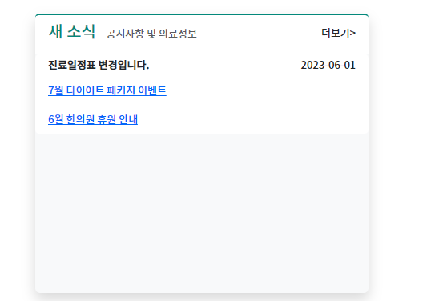

### 블로그 소식 by card

1. col 12시작 -> lg-4 안에 `div.card.w-100`을 생성하고, border-0 + 배경 bg-light + shadow,  style=로 높이 394px를 지정한다 
```html
<!-- 블로그 소식 -->
<div class="col-sm-12 col-lg-4">
    <div class="card w-100 border-0 bg-light shadow" style="height: 349px;">
        
    </div>
</div>
```
2. card내부에 div.card-header를 만든 뒤, `제목h태그` + `더보기`를 같이 배열하기 위해 `h5.d-inline-block`를 먼저 만들어놓고, content에서 제목 + small태그 부제목을 작성한다 
```html
<div class="col-sm-12 col-lg-4">
    <div class="card w-100 border-0 bg-light shadow" style="height: 349px;">
        <div class="card-header">
            <h5 class="d-inline-block">알림 <small class="ms-2 text-muted">공지사항 및 소식</small></h5>
        </div>
    </div>
</div>
```
3. `더보기`는 h5.d-inline-block아래에 `div`로 d-lnline-block과 함께, `내부a태그`로 정의해준다
    - `&gt;`로 > 우측 화살표를 만들어서 더보기에 붙여준다
```html
<div class="card-header">
    <h5 class="d-inline-block">알림 <small class="ms-2 text-muted">공지사항 및 소식</small></h5>
    <div class="d-inline-block">
        <a class="text-decoration-none" href="#">더보기&gt;</a>
    </div>
</div>
```

4. 이제 더보기를 오른쪽으로 밀기 위해서 **부모인 div.card-header를 `d-flex` + 자식 더보기는 `ms-auto`를 더보기div태그에 준다**
```html
<div class="card-header d-flex">
    <h5 class="d-inline-block">알림 <small class="ms-2 text-muted">공지사항 및 소식</small></h5>
    <div class="d-inline-block ms-auto">
        <a class="text-decoration-none text-dark fs-13" href="#">더보기&gt;</a>
    </div>
</div>
```


5. card-header배경을 bg-white(전체는 light)로 주고/ border는 top은 살리고, bottom은 -0으로 없앤다. border-크기와 색을 정한다
```html
<div class="card-header d-flex bg-white border-top border-bottom-0 border-2"
     style="border-color: var(--color-submain)!important;">
    <h5 class="d-inline-block text-submain">
        새 소식 <small class="fs-13 ms-2 text-muted">공지사항 및 의료정보</small>
    </h5>
    <div class="d-inline-block ms-auto">
        <a class="text-decoration-none text-dark fs-13" href="#">더보기&gt;</a>
    </div>
</div>
```


6. 글 내용들은 `ul.list-group` > `li.list-group-item.border-0`을 활용해서 내부에는 `a.card-link`로 작성한다
```html
<!--body-->
<ul class="list-group">
    <li class="list-group-item border-0">
        <a href="#" class="card-link">진료일정표 변경입니다.</a>
    </li>
    <li class="list-group-item border-0">
        <a href="#" class="card-link">7월 다이어트 패키지 이벤트</a>
    </li>
    <li class="list-group-item border-0">
        <a href="#" class="card-link">6월 한의원 휴원 안내</a>
    </li>
</ul>
```
7. `글자크기 일괄` 및 list-group의 `item간격`은  `부모인 ul.list-group`에서 line-height로 조정해준다.
   - a태그 이전에 `패딩은 li태그`에서
   - `글자색`은 a태그에서 적용해준다.
   - a태그들에 `text-truncate` + 글자색 진하기도 적용해준다.
```html
<ul class="list-group fs-13" style="line-height: 20px;">
   <li class="list-group-item border-0 py-1">
       <a href="#" class="card-link text-decoration-none text-dark text-truncate fw-bold">진료일정표 변경입니다.</a>
   </li>
```

8. **더보기 처럼, 작성일도 우측정렬해서 추가하기 위해 `부모인 li태그를 d-flex`로 만들고, 개별태그들이 inline이므로 d-inline-block없이 `span태그에 ms-auto`를 추가해서 작성일을 추가한다.**
   - li태그를 d-flex로 만들고, 2개이상 요소를 가지므로 수직정렬 aling-items-center도 추가해준다
   - **truncate된 ...에 의해 우측정렬된 글자가 밀리는데 `style="white-space: nowrap;"`를 small태그에 추가해준다**
```html
<li class="list-group-item border-0 py-1 d-flex align-items-center">
    <span class="badge bg-light text-main me-1">공지</span>
    <a href="#" class="card-link text-decoration-none text-dark text-truncate fw-bold ">
        진료일정표 변경입니다.
    </a>
    <small class=" ms-auto" style="white-space: nowrap;"> 2023-06-01</small>
</li>
```



9. 카테고리는 각 a태그 앞에 `span.badge.bg-색.text-글자색`을 활용해준다
   - 배경은 bg-light, 글자색은 main/submain/muted를 활용했다
   - 우측 글제목과 간격을 위해 `me-1`을 추가
```html
<li class="list-group-item border-0 py-1 d-flex align-items-center">
    <span class="badge bg-light text-main me-1">공지</span>
    <a href="#" class="card-link text-decoration-none text-dark text-truncate fw-bold ">
        진료일정표 변경입니다.
    </a>
    <small class=" ms-auto" style="white-space: nowrap;"> 2023-06-01</small>
</li>
```


10. **왼쪽 유튜브 col에 height를 고정하고, 새소식의 heigth를 지워 item갯수만큼만 차지하게 한다**


