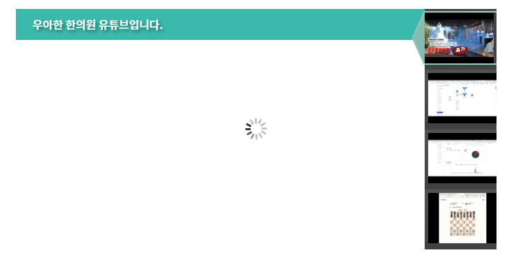

- 공식: https://dplayer.diygod.dev/guide.html#options
- 공식데모: https://github.com/DIYgod/DPlayer/blob/master/demo/demo.js
- 각종 player 모음: https://juejin.cn/post/7054090443180474398
- 
### 돌아가는 화면 만들기 
1. col안에 영상을 뿌려줄 파트를 작성한다.
   - **기존 잡아둔 col높이 349px를 삭제하고, 내부에서 컨텐츠로 채울 준비를 한다**
    - `.film_focus>.film_focus_imgs_wrap.main-content>ul.film_focus_imgs.w-85` 안에 여러 li태그를 만든다
    - li들은 div#dplayer1공간에 style="w100;h컬럼높이;"로 줘서 4개를 만든다
    - 이제 **자리 잡기를 위해 div#dplayer들 대신 img로 채워넣는다**
```html
<!--<div class="col-12 col-lg-8" style="height: 349px;">-->
<div class="col-12 col-lg-8" >
   <div class="film_focus">
      <!-- 영상 파트 -->
      <div class="film_focus_imgs_wrap main-content">
         <ul class="film_focus_imgs w-85">
            <li>
               <!--                                <div id="dplayer1" style="width: 100%;height:349px;"></div>-->
               </img>
            </li>
            <li>
               <!--                                <div id="dplayer2" style="width: 100%;height:349px;"></div>-->
               </img>
            </li>
            <li>
               <!--                                <div id="dplayer3" style="width: 100%;height:349px;"></div>-->
               </img>
            </li>
            <li>
               <!--                                <div id="dplayer4" style="width: 100%;height:100%;"></div>-->
               </img>
            </li>
         </ul>
      </div>
</div>
```


2. thumbnail이 들어갈 공간을 div.film_focus 안에 넣어준다
   - .film_focus_desc.d-none.d-md-block>ul#film.film_focus_nav 으로 작은화면에서는 안나온다
   - li들은 현재일 경우 `cur` 선택자를 갖는다.
   - li내부에는 img태그를 width 100px, height 79px로 준다?!
```html
 <!-- thumbnail 파트 -->
<div class="film_focus_desc d-none d-md-block">
    <!--제목?-->
    <h3>우아한 한의원 유튜브입니다.</h3>
    <ul id="film" class="film_focus_nav">
        <li class="cur">
            
        </li>
        <li>
            
        </li>
        <li>
            
        </li>
        <li>
            
        </li>
    </ul>
</div>
```
- 영상용 div#id 대신 img태그로 변경하고, **이미지가 가운데 정렬되도록 d-flex justify를 내가 따로 추가했다**
```html
<ul class="film_focus_imgs w-85">
    <!-- 변경) 이미지의 높이고정 -> width auto해놓고, 부모에서 가운데정렬 + 검은색 배경 -->
    <li class="d-flex justify-content-center bg-dark">
        <!--                                <div id="dplayer1" style="width: 100%;height:349px;"></div>-->
        <!--                                
        <!--                                     style="width: 100%;height:349px;"></img>-->
        
    </li>
```


3. 이제 각 요소들이 돌아가도록 js를 작성해준다.
- 중간에 주석처리된 부분은 테스트를 위한 것 + 돌아가는 시간도 5초 -> 3초 테스트를 위한 것
```js
 O.hover(function () {
     if (I) {
         clearInterval(I)
     }
 }, function () {
     // 수정
     // if(dp1.video.pause && dp2.video.pause && dp3.video.pause && dp4.video.pause) {
     //     Q()
     // }
 });
```
```js
 $(function () {
     $(".film_focus").th_video_focus({
         navContainerClass: ".film_focus_nav",
         focusContainerClass: ".film_focus_imgs",
         // delayTime: 5000
         delayTime: 3000
     });
 });
```
- 전체 코드
```html
<!-- youtube 기본 설정-->
<script type="text/javascript">
    (function (A) {
        A.fn.th_video_focus = function (E) {

            var G = {
                actClass: "cur",
                navContainerClass: ".focus_pic_preview",
                focusContainerClass: ".focus_pic",
                animTime: 600,
                delayTime: 5000
            };

            if (E) {
                A.extend(G, E)
            }

            var C = G.actClass, D = G.navContainerClass, B = G.focusContainerClass, F = G.animTime, H = G.delayTime,
                I = null;

            return this.each(function () {

                var O = A(this), M = A(D + " li", O), P = A(B + " li", O), L = M.length, K = O.height();

                function N(R) {
                    var V = K * R * -1;
                    var U = A(B + " li", O), W = null, T = null;
                    for (var S = 0; S <= R; S++) {
                        W = U.eq(S);
                        T = W.find('script[type="text/templ"]');
                        if (T.length > 0) {
                            W.html(T.html())
                        }
                    }
                    A(B, O).stop().animate({top: V}, F, function () {
                        var Y = O.find("h3"), X = Y.height();
                        Y.height(0).html(A(B + " li").eq(R).find("img").attr("alt")).animate({height: X}, 600)
                    });
                    A(D + " li").eq(R).addClass(C).siblings().removeClass(C)
                }

                function Q() {
                    if (I) {
                        clearInterval(I)
                    }
                    I = setInterval(function () {
                        var R = A(D + " li." + C).index();
                        N((R + 1) % L)
                    }, H)
                }

                O.hover(function () {
                    if (I) {
                        clearInterval(I)
                    }
                }, function () {
                    // 추가: 하나라도 실행중이면 안넘어가도록
                    // if(dp1.video.paused && dp2.video.paused && dp3.video.paused && dp4.video.paused) {
                    //     Q()
                    // }
                });

                var J = null;

                M.hover(function () {

                    var R = A(this).index();

                    if (I) {
                        clearInterval(I)
                    }
                    J = setTimeout(function () {
                        N(R)
                    }, 300)
                }, function () {
                    if (J) {
                        clearTimeout(J)
                    }
                    Q()
                }).click(function (T) {
                    var R = A(this).index(), S = P.eq(R).find("a");
                    if (document.uniqueID || window.opera) {
                        S[0].click();
                        T.stopPropagation();
                        T.preventDefault()
                    }
                });

                Q()

            })
        }

    })(jQuery);

    $(function () {
        $(".film_focus").th_video_focus({
            navContainerClass: ".film_focus_nav",
            focusContainerClass: ".film_focus_imgs",
            // delayTime: 5000
            delayTime: 3000
        });
    });
</script>
```


4. 이제 각 css 선택자별 css를 생성해준다
- 참고 이미지 github: https://github.com/bylu/js-css-/tree/85354c52b625b87a33bf7afa1a2dd90c4d52afb8/banner%E8%BD%AE%E6%92%AD/images
- 참고 css
   
- **여러 설정을 통해 찾은 col-8뿐만 아니라 col-6,7도 적용되는 css**
```css
<style>
    /* 부모는 w100에 높이를 고정하고, relative로 만들어놓는다*/
    .film_focus {
        width: 100%;
        height: 349px;
        overflow: hidden;
        position: relative;
    }

    /* 영상파트의 배경에는 로딩 이미지를 배경에 깔아둔다*/
    .film_focus .film_focus_imgs_wrap {
        width: 100%;
        /*width: 80%;*/ /*내가 해본 것. 안 먹음.*/
        height: 349px;
        background: url('images/youtube/T16WJqXaXeXXXXXXXX-32-32.gif') no-repeat center center;
    }

    /* 영상파트는 absolute로 왼쪽상단부터 위치시킨다*/
    /* 친구 .w-85로 인해 알아서 width를 잡는다*/
    .film_focus ul.film_focus_imgs {
        width: 100%;
        height: 9999em;
        position: absolute;
        left: 0;
        top: 0;
    }

    /* 영상들 부모 ul태그에서는 여백을 없애고, 리스트 스타일도 제거한다*/
    .film_focus ul {
        padding: 0;
        margin: 0;
        list-style: none;
    }

    /* 각 영상들의 부모li태그에서 height를 349로 고정한다 */
    .film_focus ul.film_focus_imgs li {
        height: 349px;
        overflow: hidden;
    }

    /* Thumbnail 영역*/

    /* 영상위의 설명란 설정 */
    .film_focus .film_focus_desc h3 {
        height: 45px;
        line-height: 45px;
        overflow: hidden;
        position: absolute;
        left: 0;
        top: 0;
        /*background: rgba(0, 0, 0, .5);*/
        background: var(--color-submain-80);
        color: #fff;
        width: 100%;
        padding-left: 24px;
        z-index: 99;
        /*font-size: 16px;*/
        /*filter:progid:DXImageTransform.Microsoft.gradient(enabled='true', startColorstr='#7F000000', endColorstr="#7F000000");*/

    }
    .film_focus ul.film_focus_nav{width:15%;height:394px;background:#424242;position:absolute;right:0;_right:-45px;top:0;z-index:100;}
    .film_focus ul.film_focus_nav li{height:86px;background:url('images/youtube/T1WiB5Xf0EXXXXXXXX-1-75.png') repeat-x;margin:1px 1px 1px 0;padding:5px 0 0 5px;position:relative;}
    .film_focus ul.film_focus_nav li.cur{background:url('images/youtube/T19yB9Xm0BXXXXXXXX-296-79.png') no-repeat 0 2px;width:150px;left:-19px;_background:url('images/youtube/T19UakXlxiXXXXXXXX-296-79.gif') no-repeat 0 2px;}
    .film_focus ul.film_focus_nav li img{position:absolute;left:5px;top:5px;}
    .film_focus ul.film_focus_nav li.cur img{left:19px;margin-top: .1px;}
    .film_focus ul.film_focus_nav li h4{color:#fff;}
    .film_focus ul.film_focus_nav li p{color:#B9B9B9;line-height:1.8em;}

    .knowcon_right {
        width: 100%;
        height: 349px;
        border-top: 2px #ff8e3b solid;
        background: #FDFDFD;
        box-shadow: 5px 5px 10px rgba(0, 0.0, 0.5);
    }

    .pulsing:before, .pulsing:after {
        content: "";
        position: absolute;
    }

    .main-content {
        display: grid;
        width: 100%;
    }

    @media (max-width: 767px) {
        .w-85 {
            width: 100% !important;
        }
    }

    @media (min-width: 768px) {
        .w-85 {
            width: 85% !important;
        }
    }
</style>
```


### youtube 이미지 부분에 dplayer js 적용하기
1. https://cdn.jsdelivr.net/npm/dplayer@1.24.0/dist/ 여기서
   - css / js 폴더에 다운 받아 넣는다
2. css와 js를 추가해준다.
   - js는 youtube 설정 코드 위에 넣어준다.
```html
<!-- index.html 전용 Dplayer css (새소식, Youtube) -->
<link rel="stylesheet" href="css/DPlayer.min.css">
```
```html
<!-- youtube DPlayer js 추가-->
<script src="js/Dplayer.min.js"></script>
<!-- youtube 기본 설정-->
```
3. 이제 `ul.film_focus_imgs.w-80` 내부 li 속에 img태그 대신 div#id로 바꿔준다.
- **사용법 참고 사이트: https://www.fly63.com/article/detial/6918**
- 4개의 영상에 대해, id를 `dplayer1`부터 4까지 주고, w-100 + height고정값으로 준다
```html
<div class="film_focus_imgs_wrap main-content">
   <ul class="film_focus_imgs w-85">
      <li class="d-flex justify-content-center bg-dark">
         <div id="dplayer1" style="width: 100%;height:349px;"></div>
         style="width: auto;height:349px;">-->
      </li>
```
- 배경에 로딩gif가 나오도록 `bg-dark`를 삭제하고, w-100으로 인해 `d-flex justify`도 같이 삭제해준다
```html
<li>
   <div id="dplayer1" style="width: 100%;height:349px;"></div>
</li>
```


4. jquery 실행함수로 script태그에 객체를 정의한다
```html
<script>
    $(function () {
        var dp1;
        var dp2;
        var dp3;
        var dp4;

        dp1 = new DPlayer({
            container: document.getElementById('dplayer1'),
            video: {
                url: 'videos/video1.mp4',
                // pic: 'https://i2.ytimg.com/vi/1j3wGl06pUs/hqdefault.jpg',
                // live: true,
            }
        });
        dp2 = new DPlayer({
            container: document.getElementById('dplayer2'),
            video: {
                url: 'videos/video2.mp4',
                // pic: 'https://i2.ytimg.com/vi/1j3wGl06pUs/hqdefault.jpg',
                live: true,
            }
        });
        dp3 = new DPlayer({
            container: document.getElementById('dplayer3'),
            video: {
                url: 'videos/video3.mp4',
                // pic: 'https://i2.ytimg.com/vi/1j3wGl06pUs/hqdefault.jpg',
                live: true,
            }
        });
        dp4 = new DPlayer({
            container: document.getElementById('dplayer4'),
            video: {
                url: 'videos/video4.mp4',
                // pic: 'https://i2.ytimg.com/vi/1j3wGl06pUs/hqdefault.jpg',
                live: true,
            }
        });
    })
</script>
```
- **추가옵션으로 `mutex: true`를 넣어주면, 여러개의 dp인스턴스가 있어도, `마지막 실행된 1개의 viddeo만 작동`하게 한다**
   - live: true로 넣어주면, 0초부터 카운팅하게 한다
```js
dp1 = new DPlayer({
   container: document.getElementById('dplayer1'),
   video: {
       url: 'videos/video1.mp4',
       live: true,
       mutex: true,
       // pic: 'https://i2.ytimg.com/vi/1j3wGl06pUs/hqdefault.jpg',
   }
});
```
5. 실행시는 자동 넘김 안되도록, **hover시, 모두 정지상태에만 돌아가도록 하는 코드 주석 해제**한다
   - **즉, 하나라도 실행 중이면, 안넘어가게 하는 코드**
```js
O.hover(function () {
   if (I) {
      clearInterval(I)
   }
}, function () {
   // hover해도 모두 정지시에만 재시작 => 하나라도 play 중이면 작동안하게 한다
   if (dp1.video.paused && dp2.video.paused && dp3.video.paused && dp4.video.paused) {
      Q()
   }
});

```

6. **이제 어떤 것이 play신호를 받았다면, interval을 멈추도록, `dp객체`들에게 리스너를 달아주자.**
   - 일단 dp객체들은 전역변수가 될 수 있도록 $(function)에서 꺼내놓는다
```html
<script>
    var dp1;
    var dp2;
    var dp3;
    var dp4;
    $(function () {
        // var dp1;
        // var dp2;
        // var dp3;
        // var dp4;

        dp1 = new DPlayer({
```
   - **이제 밑에 있는 영상 js설정 파트로 가서 dp1, dp2 ... 마다 `.on('play', )` 리스너를 달아서 `I`가 있다면 멈추도록 하는 `clearInterval(I)`를 구동시켜준다**
   - Q정의와 O.hover사이에 정의해준다
```js
// 각 영상객체마다 play시 interval 멈추기
dp1.on('play', function () {
    if (I) {
        clearInterval(I)
    }
})
dp2.on('play', function () {
    if (I) {
        clearInterval(I)
    }
})
dp3.on('play', function () {
    if (I) {
        clearInterval(I)
    }
})
dp4.on('play', function () {
    if (I) {
        clearInterval(I)
    }
})
```
7. **한편,hover or 자동으로 넘어갈 때 실행되는 `N` function에서  모든 video들이 멈추도록 function N(R) 맨 아래에 `모든 dp객체.pause()`를 다 호출해준다**
```js
function N(R) {
   var V = K * R * -1;
   var U = A(B + " li", O), W = null, T = null;
   for (var S = 0; S <= R; S++) {
      W = U.eq(S);
      T = W.find('script[type="text/templ"]');
      if (T.length > 0) {
         W.html(T.html())
      }
   }
   A(B, O).stop().animate({top: V}, F, function () {
      var Y = O.find("h3"), X = Y.height();
      Y.height(0).html(A(B + " li").eq(R).find("img").attr("alt")).animate({height: X}, 600)
   });
   A(D + " li").eq(R).addClass(C).siblings().removeClass(C)

   //추가2
   dp1.pause();
   dp2.pause();
   dp3.pause();
   dp4.pause();
}
```

8. 이제 테스트용 시간을 3초 -> 5초마다 넘어가도록 수정해준다
```js
$(function () {
  $(".film_focus").th_video_focus({
      navContainerClass: ".film_focus_nav",
      focusContainerClass: ".film_focus_imgs",
      // delayTime: 3000
      delayTime: 5000
  });
});
```

### h3태그에 영상 nav의 img태그 속 alt 텍스트 삽입하기
1. 기본적으로 환면전환시 호출되는 `N` functiond에는
   - `O`의 소개영상 전체파트에서 `h3`태그를 찾아, caption을 설정하는 영역으로 보고
   - 영상파트(배너 그림파트)인 `.film_focus_imgs` 속 li 속 img태그의 alt를 가져와 h3태그의 값으로 설정시킨다
   - 이 때, `A(B + " li").eq(R).find("img").attr("alt")`에서 `B`가 `.film_focus_imgs`를 의미하고, `R`은 0부터 시작하는 번호이다.
```js
function N(R) {
    /* */
    A(B, O).stop().animate({top: V}, F, function () {
        var Y = O.find("h3"), X = Y.height();
        Y.height(0).html(A(B + " li").eq(R).find("img").attr("alt")).animate({height: X}, 600)
        Y.height(0).html((R + 1) + " " + A(D + " li").eq(R).find("img").attr("alt")).animate({height: X}, 300)
    });
    /* */
}
```

2. 영상(배너그림)파트가 아니라 `navigation 쪽 파트`의 li 속 img 속 alt를 가져오려면, **B 대신 D로 찾아야한다.**
```js
Y.height(0).html(A(D + " li").eq(R).find("img").attr("alt")).animate({height: X}, 600);
```
- 참고로 B와 D는 자동으로 설정되는 것 같다. class명이 우리가 작성한 css가 아닌데도, 각각을 가져온다
   - B: 영상부분
   - D: 네비부분(thumbnail)
```js
D = G.navContainerClass, B = G.focusContainerClass
```

3. 이제 각 영상의 번호를 [ R + 1 ]로 ㅍ시하면서 img태그의 alt가 h3에 삽입되게 한다
```js
A(B, O).stop().animate({top: V}, F, function () {
    var Y = O.find("h3"), X = Y.height();
    /* custom 1: thumbnail파트에서 li > img태그 속 alt를 찾도록 변경*/
    // Y.height(0).html(A(B + " li").eq(R).find("img").attr("alt")).animate({height: X}, 600)
    /* custom 2: 글자 앞에 영상 갯수 + 현재번호 추가하기 */
    // Y.height(0).html(A(D + " li").eq(R).find("img").attr("alt")).animate({height: X}, 600);
    var total = A(D + " li").length;
    Y.height(0).html("[" + (R + 1) + "/" + total + "] " + A(D + " li").eq(R).find("img").attr("alt")).animate({height: X}, 300)
});
```

4. 전활될때 뿐만 아니라, 처음에도 배치하도록, Y+R,A,D 등이 정의된 바로 직후 h3태그 초기화하기
   - total은 일정한 값이니 초기화한 값 custom 3에서도 재활용하기
```html
<!-- 소개영상 기본 js 설정-->
<script type="text/javascript">
   // 재활용 변수
    var total;
    (function (A) {
        A.fn.th_video_focus = function (E) {
            var C = G.actClass, D = G.navContainerClass, B = G.focusContainerClass, F = G.animTime, H = G.delayTime,
                I = null;

            return this.each(function () {
                var O =     A(this), M = A(D + " li", O), P = A(B + " li", O), L = M.length, K = O.height();

                // custom 4 : 전환뿐만 아니라 초기에도 h3에 alt반영해주기
                var Y = O.find("h3"), X = Y.height();
                total = A(D + " li").length;
                Y.height(0).html("[" + (0+1) + "/" + total + "] " + A(D + " li").eq(0).find("img").attr("alt")).animate({height: X}, 300)

                function N(R) {
                    //
```


### 작은화면에서도 nav가 보이도록 수정

