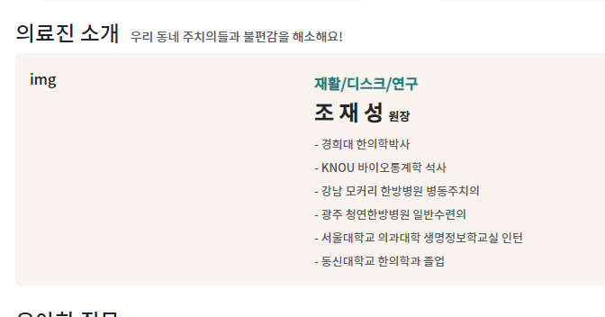
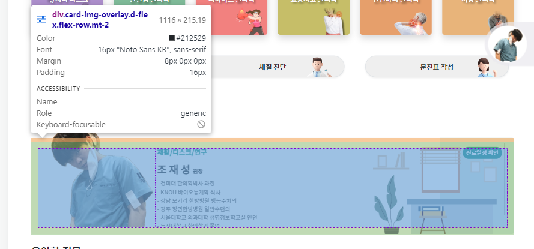

1. 위쪽 인물사진은 lg일때만 나오도록 row를 설정한다
2. col을 3(인물사진) + 나머지(글)로 설정하려고 했으나, `card 이미지 + 텍스트 `로 구성하게 한다
```html
<!-- 인물 자세히 -->
<div class="row d-none d-lg-block">
    <!--<div class="col-3"></div>-->
    <div class="col">
        <div class="card">

        </div>
    </div>
</div>
<!-- 인물 영상 -->
<div class="row">
    <div class="col-12 col-sm-6 col-lg-3"></div>
    <div class="col-12 col-sm-6 col-lg-3"></div>
    <div class="col-12 col-sm-6 col-lg-3"></div>
    <div class="col-12 col-sm-6 col-lg-3"></div>
</div>
```

3. card모양을 원하는 것은 아니므로, `div.card.border-0.w-100`으로 수정한다. 그리고 배경이미지를 `img.card-img`를 사용하여 w-100 등의 속성을 활용하여 배경으로 만든다
    - **img태그를 그대로 올려두고, `위에 내용물을 아래쪽에서 div.card-img-overlay`를 정의하여 덮어씌울 계획이다.**
4. **col-3 + col을 대체할 `div.card-img-overlay` > `div.w-25` + `div.w-75`를 활용한다**
    - `.card-img-overlay {position: absolute;...}`로서 **위에 img태그위에 바로 덮어씌우는 개념이다.**
    - **또한 overlay의 구성(25+75)이 row방향으로 갈 수 있도록 `d-flex flex-row`도 추가해야한다**
```html
<!-- 인물 자세히 -->
<div class="row d-none d-lg-block">
    <!--<div class="col-3"></div>-->
    <div class="col">
        <div class="card border-0 w-100">
            
            <div class="card-img-overlay d-flex flex-row">
                <div class="w-25"></div>
                <div class="w-75"></div>
            </div>
        </div>
    </div>
</div>
```


5. 먼저 div.w-75에 글을 작성한다
   - .card-title>h4 에 큰제목을
   - .card-subtitle>h6 에 작은 제목을
   - .card-text 에 내용들을 작성한다
   - **나열할 것들은 `ul.list-unstyle`을 활용한다**
```html
<div class="w-75">
   <div class="card-subtitle my-2">
      <h6 class="h6 text-submain fw-bold">재활/디스크/연구</h6>
   </div>
   <div class="card-title mb-2">
      <h4 class="h4 fw-bold">조 재 성 <small class="fs-13 ">원장</small></h4>
   </div>
   <div class="card-text fs-13 fw-light text-muted ">
      <ul class="list-unstyled lh-lg">
         <li>- 경희대 한의학박사</li>
         <li>- KNOU 바이오통계학 석사</li>
         <li>- 강남 모커리 한방병원 병동주치의</li>
         <li>- 광주 청연한방병원 일반수련의</li>
         <li>- 서울대학교 의과대학 생명정보학교실 인턴</li>
         <li>- 동신대학교 한의학과 졸업</li>
      </ul>
   </div>
</div>
```



6. 이제 div.w-25에 img(인물png)를 `img.fluid`로 입력해준다
```html
<div class="w-25">
   
</div>
```


7. **먼저 `div.card`의 위쪽에 `그림이 넘칠만큼의 여백을 margin-top`으로 미리 만든다.**
```html
<div class="col">
    <div class="card border-0 w-100 rounded-0" style="margin-top: 100px">
        
        <div class="card-img-overlay d-flex flex-row">
```


8. **현재 `배경용 img.card-img`보다 `내부요소용 .card-overlay`의 w-25속 img.img-fluid가 `아래로 넘치는 상황`이며, 일부러 이렇게 만들었다.**
   - **overlay 하위 img부분인 `div.w-25`에 margin-top을 `마이너스`로** 줘서, 배경보다 아래로 넘친 이미지를 위로 올린다.
   - **이 때, `lg경계선`에서 확대되면, `가로형`인 배경용img의 height(auto)보다, `세로형`인 인물의 height가 `더 크게 확장`되므로, 경계선상태에선 약간 더 위쪽으로 올라오게 만든다**
      - **오히려 `cotainer가 늘어나는 최대치에서 하한선을 맞추는`게 더 좋을 듯 하다**
   - 위로 확보한 공간보다 조금 더 크게 margin-top을 줘야, 내려간 이미가 올라갈 것이다.

```html
<div class="col">
    <div class="card border-0 w-100 rounded-0" style="margin-top: 100px">
        
        <div class="card-img-overlay d-flex flex-row">
            <div class="w-25" style="margin-top: -90px">
```


9. 하지만, 배경그림에 대해 `인물 + 글자부분`도 함께 내려야할 경우, .card-img-overlay에 `mt-x`를 줘서 **같이 내린 다음, 이미지 부분에만 `p-x`를 줘서 fluid자체의 공간자체를 줄인다**
```html
<div class="col">
   <div class="card border-0 w-100 rounded-0" style="margin-top: 100px">
      
      <div class="card-img-overlay d-flex flex-row mt-2">
         <div class="w-25 p-1" style="margin-top: -90px">
```


10. 글자부분도 p-x로 `div.w-75`에 p-x를 줘서 전체적 크기를 축소할 수 있다
   - 또한 margin-top을 마이너스로 줘서 약간 더 올릴 수 있다.
```html
<div class="w-75 p-1" style="margin-top: -15px">
```


### 인물이미지 w-x를 반응형으로 만들기
1. row에 있던 `d-none d-lg-block`을 제거하고, **인물 이미지(div.card-img)를 평소보다 조금 더 내려오게 만든다**
```html
<!--<div class="row d-none d-lg-block">-->
  <div class="row ">
      <div class="col">
          <div class="card border-0 w-100 rounded-0" style="margin-top: 80px">
              
              <div class="card-img-overlay d-flex flex-row mt-2 ">
```


2. lg에서는 25/75 지만, 작아질수록, 이미지가 더 줄어드므로 **md상황(~767/768~)부터 아주 작은 상황까지**에서도 이미지가 약간 빠져나올 비율을 찾아놓고
   - **.w-25, .w-75 선택자에 css로 반응형 쿼리를 작성해준다.**
   - 확인해보니 md이하에서는 35/65 비율을 유지하면 된다.
```css
 @media (max-width: 767px) {
     .w-25 {
         width: 35% !important;
     }
     .w-75 {
         width: 65% !important;
     }
 }
```


3. 모든 .w-25 와 .w-75에 적용되면 안되므로, min-width:768 (md초과)부터는 25/75로 지정해주고, 이하에는 35/65를 유지하는 **새로운 선택자 `.w-35to25 .w-36to-75`를 정의해준다.**
```css
 @media (max-width: 767px) {
     .w-35to25 {
         width: 35% !important;
     }
     .w-65to75 {
         width: 65% !important;
     }
 }

 @media (min-width: 768px) {
     .w-35to25 {
         width: 25%!important;
     }
     .w-65to75 {
         width: 75% !important;
     }
 }
```
```html
<!---->
<div class="w-35to25 " style="margin-top: -80px">
<!-- -->
<div class="w-65to75 p-1 overflow-y-auto" style="margin-top: -15px">
```

4. 이제 좀 더 세분화해서 처리해본다
```css
    @media (max-width: 767px) {
        .w-35to25 {
            width: 35% !important;
        }
        .w-65to75 {
            width: 65% !important;
        }
    }

    @media (min-width: 768px) {
        .w-35to25 {
            width: 33%!important;
        }
        .w-65to75 {
            width: 67% !important;
        }
    }


    @media (min-width: 1200px) {
        .w-35to25 {
            width: 25%!important;
        }
        .w-65to75 {
            width: 75% !important;
        }
    }
```

4. **이제 인물사진쪽은 `.overflow-hidden`을 주고, 텍스트쪽은 `.overflow-y-auto`를 준다.**
   - mt으로 올린 부분은 overflow에 안걸리고, 아래로 빠져나온부분만 걸리기 때문에, 아래만 짤리게 된다.
```html

<div class="w-35to25 overflow-hidden" style="margin-top: -80px">

<div class="w-65to75 p-1 overflow-y-auto" style="margin-top: -15px">

```


5. 이제 div.card-img-overlay에 padding이 있어서, 밑에 만땅으로 못채우는데, `pb-0`을 넣어주자

```html
<div class="card-img-overlay d-flex flex-row mt-2 pb-0">
```


6. 작은화면에서 다 보는 링크(진료일정 확인) 버튼을 float-end로 추가해준다.
```html

<div class="card-subtitle my-md-1">
    <h6 class="h6 text-submain fw-bold d-inline-block ">근골격계 • 연구</h6>
    <div class="btn btn-sm btn-outline-success border-0 rounded-pill bg-submain  m-0 float-end me-md-2 fs-13  text-white">
        진료일정 확인
    </div>
</div>
```


7. 글자부분은 크기가 커지면 약력 위쪽에 여백을 추가한다 `pt-lg-4`

```html
<div class="w-65to75 p-1 pt-lg-4 overflow-y-auto" style="margin-top: -15px">
```

8. **원장이름은 스페이스 대신 letter-spacing을 줘서, db에서 받아올때도 처리되게 한다**
```html
<h4 class="fw-bold" style="letter-spacing: 2px">
   조재성 <small class="fs-13 ">원장</small>
</h4>
```
- **원장이름은 글자체가 바뀔 수 있고, 글자크기도 적용해야하기 때문에 fs-index처럼 `fs-doctor`를 정의해서 ls도 같이 주자**

```css
/* 원장 이름 */
.fs-doctor {
    font-size: 20px;
    letter-spacing: 4px;
}

@media screen and (min-width: 768px) {
    .fs-doctor {
        font-size: 1.5rem;
        letter-spacing: 8px;
    }
}
```
```html
<div class="card-title mb-2">
   <h4 class="fw-bold fs-doctor">
      조재성 <small class="fs-13 ">원장</small>
   </h4>
</div>
```
