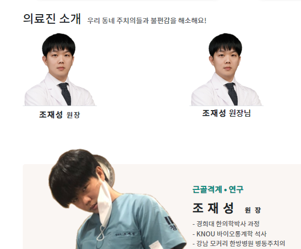
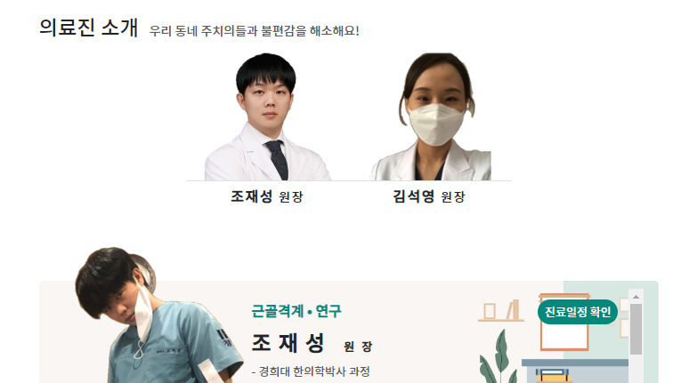
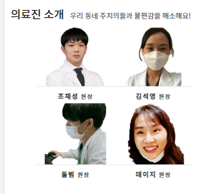
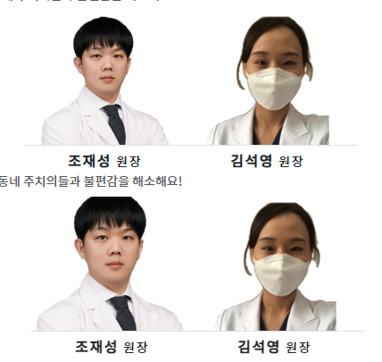
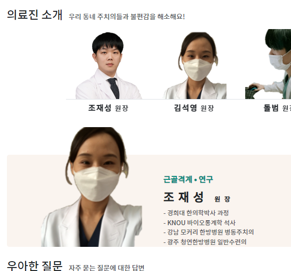

### 증명사진 디자인

1. 각 인물영상은 정해진 col크기에서 `div.card>div.card-img+.card-body+.card-footer`로 구성될 것이다.
2. 영상대신 div.card-img에 `img.img-fluid`를 정해진 사각크기에 맞게 입력한다
3. `div.card-body`에 들어갈 텍스트들의 가운데 정렬은 `div.card`에서 전체요소들에게 가운데 정렬시키자. text-center
    - 개별 세로 나열은 `ul.list-unstyled>li`를 활용한다
    - 여차하면 br태그로 줄바꿈해준다.
4. `div.card-footer`에 들어갈 단어는 h6>strong 을 활용한다
5. **커스텀을 시행함**
   - card에 border-0을 추가한다
   - card-body에 border-top만 줘서, 이미지 밑에 줄이 생기게 한다
   - card-body에 py-1을 줘서 위아래 간격을 고정시킨다
   - footer는 border-0을 주고, p-0을 주고, 배경을 bg-transparent를 준다
   
6. **추가 커스텀 for swiper**
   1. **`img태그의 부모div`의 `height`를 150px `고정`**하고, **img태그의 img-fluid를 삭제하고 , `h-100 w-auto`를 줘서, `이미지를 고정된 부모높이`에 맞춘다**
   2. **card자체를 `width:fit-content`로 줘서, 사진 너비에 꽉맞춰, border도 사진크기에 맞춘다**
   3. card-footer는 주석처리한다
```html
<div class="card text-center border-0 m-0" style="width: fit-content;">
    <div class="card-img overflow-hidden" style="height: 150px; ">
        
    </div>
    <div class="card-body border-top py-1 ">
        <span class="fw-bold fs-index" style="letter-spacing: 1.5px">조재성 <small class="fw-light">원장</small></span>
    </div>
</div>
```

7. div.card-img의  height를 md이상시 150px md미만시 120px로 반응형 `.h-120to150`을 정의해준다.
```css
    @media (max-width: 767px) {
   .w-35to25 {
      width: 35% !important;
   }
   .w-65to75 {
      width: 65% !important;
   }
   .h-120to150 {
      height: 120px !important;
   }
}

@media (min-width: 768px) {
   .w-35to25 {
      width: 33%!important;
   }
   .w-65to75 {
      width: 67% !important;
   }
   .h-120to150 {
      height: 150px !important;
   }
}

```
```html
<!--<div class="card-img overflow-hidden" style="height: 150px;">-->
<div class="card-img overflow-hidden h-120to150">
```


8. 이제 col안에서, 여러개의 card를 붙혀 배치하기 위해 col에 d-flex flex-row justify-content-center를 주자
```html
<div class="row justify-content-center">
   <div class="col d-flex flex-row justify-content-center" >
```
9. 사진들끼리 너무 붙어있는 것 같아서, border는 유지하도록 `div.card-img`에 `px-3`을 준다. ****
```html
<div class="card-img overflow-hidden h-120to150 px-3">
   
</div>
```


10. 축소를 해보면 `div.card-img`에 rounded가 깔려있어서 제거한다 rounded-0
```html
<div class="card-img overflow-hidden h-120to150 px-3 rounded-0">
   
</div>
```
11. 축소시 한줄용 col에만 있어서, 다음줄로 안넘어가는데,flex-wrap을 추가해 다음줄로 넘어가게 한다
   - swiper를 추가하면 필요없어질 옵션이다?!
```html
<div class="col d-flex flex-row justify-content-center flex-wrap" >
```



### 증명사진 <-> 인물 자세히 간에 css선택자로 hover걸고 + data-i=""로 순서 넘겨받기
1. 증명사진 card마다 (원래는 col마다) `.doctor-hover` 선택자와 `data-i="1"` 1부터 데이터를 심어놓는다.
```html
<div class="card text-center border-0 m-0 doctor"
     style="width: fit-content;"
     data-i="1"
>
```
2. 원래는 col.css -> `.children('.card').addClass('shadow')`로 **직접적인 자식은 .find()ㅇ벗이 바로 .children()선택자로 선택하여 card의 shadow를 줘서 hover를 확인**시킨다
   - **여기서는 card.css에서 `.find('.card-img>img')`로 img태그를 찾아, addClass가 아닌 `.css(속성, 값)`으로 transform, scale()을 준다**
   - hover는 항상 하고 나서, function을 연결하여 복구하는 것을 동시에 처리해준다

```html
<script type="text/javascript">
    $(function () {
        $('.doctor-hover').hover(function () {
            /* hover 시작시*/
            /* - 증명사진 확대*/
            $(this).find('.card-img>img').css('transform', 'scale(1.2)')
        }, function() {
           /* hover 종료시*/
            $(this).find('.card-img>img').css('transform', 'scale(1)'); // 이미지 크기 원래대로 복원
        });
    })
</script>
```

3. **이미지에 border제외 증명사진끼리 여백을 주려고 `px-3`을 추가햇었는데, `확대시 머리가 올라갈 공간`을 위해 `pt-2`도 추가한다**
```html
<div class="card-img overflow-hidden h-120to150 px-3 pt-2 rounded-0">
   
</div>
```

4. **모바일을 고려하여 hover ->` on & mousenter + focusin` 을 동시에 건다**
   - 걸어서, 텍스트에 shadow도 같이 준다.
```html
<!-- 의료진 소개 -->
<script type="text/javascript">
    $(function () {
        // $('.doctor-hover').hover(function () {
        $('.doctor-hover').on('mouseenter focusin', function() {
            /* hover 시작시*/
            $(this).find('.card-img>img').css('transform', 'scale(1.2)') // 증명사진 확대
            $(this).find('.card-body>span').addClass('text-shadow-sm') // 이름 shadow

        // }, function() {
        }).on('mouseleave focusout', function() {
            /* hover 종료시*/
            $(this).find('.card-img>img').css('transform', 'scale(1)'); // 이미지 크기 원래대로 복원
            $(this).find('.card-body>span').removeClass('text-shadow-sm') // 이름 복구
        });
    })
</script>
```

5. 이제 hover시 $(this)에서 .attr("data-i")로 받은 순서에 따라, switch 문으로 정보를 표시해줄 준비를 한다.
```js
var data_i = $(this).attr("data-i")
switch (data_i) {
    case 1:

        break;
    case 2:

        break;
    case 3:

        break;
    case 4:

        break;
}
```


6. **이제 인물 자세히 부분에서 `바뀌는 부분들에 doctor_xxx`의 id를 기입해준다.**
```html


<h6 id="doctor_role" class="fs-index text-submain fw-bold d-inline-block ">
   근골격계 • 연구
</h6>

<div id="doctor_btn" class="btn btn-sm btn-outline-success border-0 rounded-pill bg-submain  m-0 float-end me-md-2 fs-13  text-white">
   진료일정 확인
</div>

<h4 class="fw-bold fs-doctor" >
   <span id="doctor_name">조재성</span> <small class="fs-13 ">원장</small>
</h4>

<ul id="doctor_career" class="list-unstyled lh">
   <li>- 경희대 한의학박사 과정</li>
   <li>- KNOU 바이오통계학 석사</li>
   <li>- 강남 모커리 한방병원 병동주치의</li>
   <li>- 광주 청연한방병원 일반수련의</li>
   <li>- 서울대학교 의과대학 생명정보학교실 인턴</li>
   <li>- 동신대학교 한의학과 졸업</li>
</ul>
```

7. 이미지의 경우, .attr('src', '경로')로 값을 바꿔준다.
   - case를 잡을 때 `case "1"`로 문자열로 잡아야 잡히더라.. -> parseInt 해준다.
   - 배경은 홀짝에 따라 달라지도록 하기 위해 data_i를 2로 나눈 나머지로 처리해준다.
```js
$('.doctor-hover').on('mouseenter focusin', function () {
/* hover 시작시*/
$(this).find('.card-img>img').css('transform', 'scale(1.2)') // 증명사진 확대
$(this).find('.card-body>span').addClass('text-shadow-sm') // 이름 shadow

var data_i = parseInt($(this).attr("data-i"));
var bg_i = data_i % 2;
    switch (data_i) {
        case 1:
            console.log('case 1')
            $('#doctor_bg').attr('src', 'images/doctors/bg00' + bg_i + '.png')
            $('#doctor_pic').attr('src', 'images/doctors/doctor00' + data_i + '.png')
            break;
        case 2:

            break;
        case 3:

            break;
        case 4:

            break;
    }
```
- data_i를 쓰는 변경과정은 모두 동일하니, **case문 밖으로 빼준다.**
```js
$('.doctor-hover').on('mouseenter focusin', function () {
    /* hover 시작시*/
    $(this).find('.card-img>img').css('transform', 'scale(1.2)') // 증명사진 확대
    $(this).find('.card-body>span').addClass('text-shadow-sm') // 이름 shadow

    var data_i = parseInt($(this).attr("data-i"));
    var bg_i = data_i % 2;

    /* 그림 변경 */
    $('#doctor_bg').attr('src', 'images/doctors/bg00' + bg_i + '.png')
    $('#doctor_pic').attr('src', 'images/doctors/doctor00' + data_i + '.png')
```



8. text의 경우 `.text()`로 바꾼다. 바뀌어야할 css는 `.removeClass().addClass()`로 처리한다.
```js
switch (data_i) {
    case 1:
        $('#doctor_role').text('근골격계 • 연구 • 개발');
        $('#doctor_role').removeClass('text-main').addClass('text-submain')
        $('#doctor_btn').removeClass('bg-main').addClass('bg-submain')
        $('#doctor_name').text('조재성');
        break;
    case 2:
        $('#doctor_role').text('여성 • 피부미용 • 다이어트');
        $('#doctor_role').removeClass('text-submain').addClass('text-main')
        $('#doctor_btn').removeClass('bg-submain').addClass('bg-main')
        $('#doctor_name').text('김석영');
        break;
```
- data_i, bg_i에 따라 번갈아바뀌는 role, btn의 색은 공통처리로 뺀다
```js
var data_i = parseInt($(this).attr("data-i"));
var bg_i = data_i % 2;

/* 인물자세히 사진 변경 */
$('#doctor_pic').attr('src', 'images/doctors/doctor00' + data_i + '.png');

/* 배경 변경 */
$('#doctor_bg').attr('src', 'images/doctors/bg00' + bg_i + '.png');

/* 번갈아가는 글자색 및 버튼배경색 변경 */
if (bg_i == 1) {
   $('#doctor_role').removeClass('text-main').addClass('text-submain')
   $('#doctor_btn').removeClass('bg-main').addClass('bg-submain')
} else {
   $('#doctor_role').removeClass('text-submain').addClass('text-main')
   $('#doctor_btn').removeClass('bg-submain').addClass('bg-main')
}
switch (data_i) {
   case 1:
      $('#doctor_role').text('근골격계 • 연구 • 개발');
      $('#doctor_name').text('조재성');
      break;
```
9. **ul에 id를 준 상태로 `li태그를 포함한 텍스트`는 `.html()`를 이용해야하며, 내용은 백틱을 활용한다**
```js
switch (data_i) {
    case 1:
        $('#doctor_role').text('근골격계 • 연구 • 개발');
        $('#doctor_name').text('조재성');
        $('#doctor_career').html(`
          <li>- 경희대 한의학박사 과정</li>
          <li>- KNOU 바이오통계학 석사</li>
          <li>- 강남 모커리 한방병원 병동주치의</li>
          <li>- 광주 청연한방병원 일반수련의</li>
          <li>- 서울대학교 의과대학 생명정보학교실 인턴</li>
          <li>- 동신대학교 한의학과 졸업</li>
        `)

        break;
    case 2:
        $('#doctor_role').text('여성 • 피부미용 • 다이어트');
        $('#doctor_name').text('김석영');
        $('#doctor_career').html(`
          <li>- 前 관악구 백구한의원 진료원장</li>
          <li>- 광주 청연한방병원 일반수련의</li>
          <li>- 동신대학교 한의학과 졸업</li>
        `)
        break;
```
