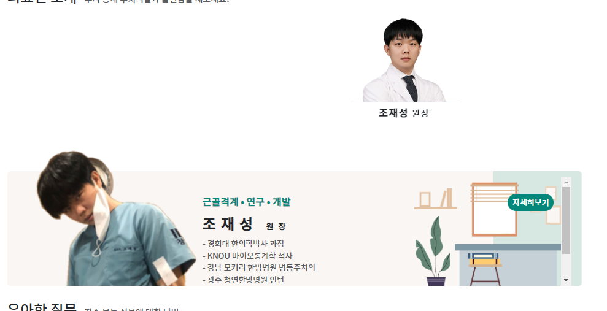
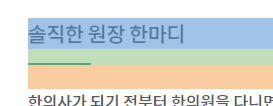
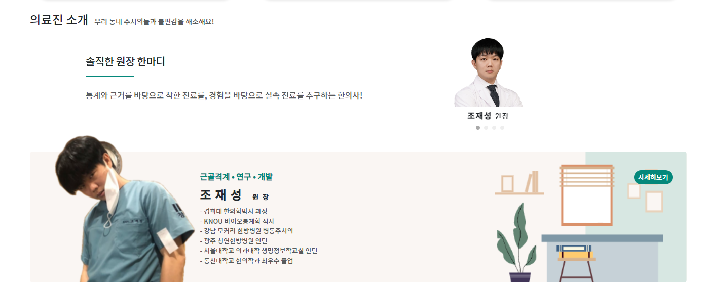

1. col <->  content(card) 사이에 `div.swiper.xxxxSwiper` > `div.swiper-wrapper` > 개별 card마다 `div.swiper-slide` 씌우기

2. col에 있던 flex설정들을 삭제하고, 좌측에 col-7 / 우측col-5 을 둔다음, 우측 col-5에 배치한다.
- row에 align-items-center를 추가해서 한 row의 col들이 수직가운데 정렬되게 한다
3. .xxxSwiper 선택자로 swiper 객체 만들고 설정하기
    - pagination없이 1개만 보이도록 일단 설정
    - spacebetween: 0이 핵심 중 하나
    - autoplay로 지정해서, eventlistener로 focusin 되게 할 예정

```js
<!-- 의료진 소개 swiper-->
<script>
    var doctorSwiper = new Swiper(".doctorSwiper", {
    slidesPerView: 1,
    // slidesPerView: 'auto',
    spaceBetween: 0,
    grabCursor: true,
    loop: true,
    autoplay: {
    delay: 4500,
    disableOnInteraction: false,
},
   pagination: {
   el: ".doctorSwiper .swiper-pagination",
   clickable: true,
},
});
</script>
```

4. **이제 `active slide`가 돌아가면, 해당 card에 focusin이 작동하도록 `swiper객체에 on`을 걸어준다.**
   - **추가로 나머지 슬라이드들은 focusout시킨다.**

```js
doctorSwiper.on("slideChangeTransitionEnd", function () {
    var activeSlide = doctorSwiper.slides[doctorSwiper.activeIndex];
    $(activeSlide).find('div.card').focusin();
   // 나머지 slide들을 focusout한다
   $(doctorSwiper.slides).not(activeSlide).find('div.card').focusout();
});
```



5. **제일 깔끔한 방법은 1개의 slide + pagination이다.**
6. slide의 크기는 건들지말고, **swiper전체 크기만 1개 이미지보다 약간 더 큰 크기로 준다**
   - h-110to150 을 h-90to150으로 수정함. 90 -> 115px,  150 -> 180px로 swiper크기만 반응형으로 잡아준다.
```css
<style>
    .doctorSwiper {
        max-width: 180px!important;
    }
    .doctorSwiper .swiper-wrapper {
        align-items: center;
    }
    @media (max-width: 767px) {
        .doctorSwiper {
            max-width: 115px!important;
        }
    }
    .doctorSwiper .swiper-pagination {
        bottom: -2px !important;
    }
    .doctorSwiper .swiper-pagination-bullet {
        background-color: darkgray;
    }
```
7. pagination은 약간 내려준다
```css
    .doctorSwiper .swiper-pagination {
        bottom: -2px !important;
    }

    .doctorSwiper .swiper-pagination-bullet {
        background-color: darkgray;
    }
```
8. 원장한마디란을 만들기 위해, col을 offset-1 + col-6 | swiepr 5로 잡고
   - 글자들을 세로배치하기 위해 d-flex flex-column을 주고 justify로 가운데 정렬한다
   - 원장한마디용 폰트를 css로 정의한다(fs-desc)
   - 원장한마디에 **after로 줄을 긋기 위해 `.doctor-desc`선택자를 주고 :after를 정의하며 after는 자식으로서 부모에게 relative를 준다**
   - 원장한마디 내용은 focus시 바뀌도록 `id="doctor_desc`를 준다

```html
<!-- 증명사진 -->
<div class="row align-items-center">
    <div class="offset-1 col-6 d-flex flex-column  justify-content-center ">
        <div class="fs-desc lh-base doctor-desc position-relative pb-2 pb-md-3 mb-2 mb-md-4 text-wrap">
            솔직한 원장 한마디
        </div>
        <p class="fs-index text-muted" id="doctor_desc">
            통계와 근거를 바탕으로 착한 진료를, 경험을 바탕으로 실속 진료를 추구하는 한의사!
        </p>
    </div>
    <div class="col-5">
        <!-- Swiper -->
    </div>
```
```css
.fs-desc {
    font-size: 15px;
    letter-spacing: -1px;
}

@media screen and (min-width: 768px) {
    .fs-desc {
        font-size: 1.3rem;
        letter-spacing: -0.5px;
    }
}
```
```css
    .doctor-desc:after {
        content: "";
        display: block;
        position: absolute;
        width: 5vw;
        height: 2px;
        background: var(--color-submain);
        left: 0;
        bottom: 0px;
    }
```
- after를 입힐땐, pb로 간격을 만들고, mb로 after보다 더 아래쪽까지 간격을 준다.
```html
<div class="fs-desc lh-base doctor-desc position-relative pb-2 pb-md-3 mb-2 mb-md-4 text-truncate">
```


