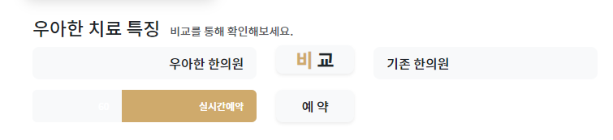
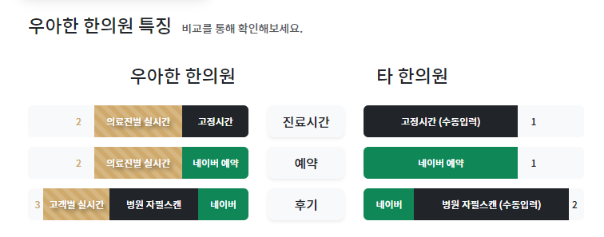
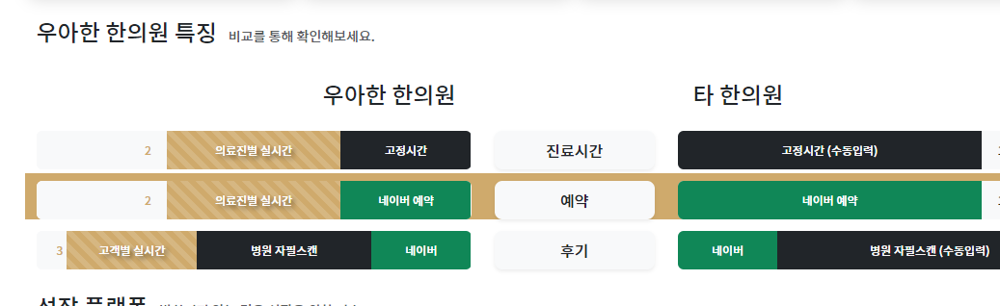

### 디자인

- 위와 같은 모양을 만들 예정이며, `auto | 2 | auto`의 칼럼을 채울 것이다.
```html
<div class="row">
    <div class="col"></div>
    <div class="col-2"></div>
    <div class="col"></div>
</div>
```


1. 가운데 col-2부분에 제목글자를 집어넣을텐데 후처리를 위해 `빈div`안에 개별 글자색 처리는 `b태그에 text-x`로 클래스를 준다
```html
<div class="row">
    <div class="col"></div>
    <div class="col-2">
        <div class="h4 text-center bg-light rounded-1 shadow">
            <b class="text-doctor">우</b> <b class="text-dark">타</b>
        </div>
    </div>
    <div class="col"></div>
</div>
```


2. 양측 col부분에, 비교할 대상들을 적어준다. 역시 꾸며줄 빈div안에 글자를 적는다.
    - 특정 속성이 필요하지 않으면 안에 적을 글자도 div로 준다
    - 회색배경에 rounded를 줘서, hover에 대비한다
    - **왼쪽col의 글자는 text-end, 오른쪽 col의 글자는 text-start 줘서 가운데 붙게 한다**
       - 이 때, pe-x  와 ps-x를 줘서, 너무 딱 붙지 않게 한다 
```html
<!-- 제목 row -->
<div class="row align-items-center">
    <div class="col">
        <div>
            <div class="bg-light text-end pe-3 rounded-3 fs-index py-2">
                우아한 한의원
            </div>
        </div>
    </div>
    <div class="col-2">
        <div class="h4 py-1 text-center bg-light rounded-3 shadow">
            <b class="text-doctor">비</b> <b class="text-dark">교</b>
        </div>
    </div>
    <div class="col">
        <div>
            <div class="bg-light text-start ps-3 rounded-3 fs-index py-2">
                기타 한의원
            </div>
        </div>
    </div>
</div>
```


3. 이제 각 row별 제목과 progress를 입력해야한다. 가운데 col-2부터 채워준다.
   - 가운데는 rounded + text-center sadhow bg-light p-x 를 빈div에 채워서 텍스트를 입력한다
   - 가운데 글자를 위해 col-4로 수정했다.
```html
<div class="row">
    <div class="col"></div>
    <div class="col-2">
        <div class="rounded-3 text-center fs-index shadow-sm p-2 bg-light">예약</div>
    </div>
    <div class="col"></div>
</div>
```

4. 좌/우 progress는 **div.w-100.progress.bg-light**안에 > 글자(bar지만 배경과 같은색으로 안보임+실제%의 나머지%로 width) + bar(다른배경 + 실제%만큼의 width차지) div로 구성된다.
```html
<div class="col">
    <div class="w-100 progress bg-light">
        <div>60</div>
        <div>실시간 자체예약</div>
    </div>
</div>
```


5. width 40%로 배경과 같은색(bg-light)으로 숫자60를 적고, width 60%에 bar배경을 줘서 칸 + 글자을 채운다
   - 숫자가 bar에 붙도록 text-end를 주고, pe-3으로 약간 띄워준다.
   - 이제 div.progress에 height를 직접줘서, 가운데 col-2와 높이를 비슷하게 만든다.
   - 해당 row에 my를 통해 간격을 주고, pt를 통해 자체크기를 조금 줄인다.
```html
<div class="row my-1 pt-2">
    <div class="col">
        <div class="w-100 progress bg-light" style="height: 40px;">
            <div class="progress-bar bg-light text-end pe-3" style="width: 40%">
                60
            </div>
            <div class="progress-bar bg-doctor text-end pe-3 text-doctor" style="width: 60%">
                실시간예약
            </div>
        </div>
    </div>
    <div class="col-2">
        <div class="rounded-3 text-center fs-index shadow-sm p-2 bg-light">예 약</div>
    </div>
    <div class="col">

    </div>
</div>
```


6. 글자쪽에 `.progress-bar-striped.progress-bar-animated`를 추가해서 줄무늬를 추가할 수 있다.

7. 이제 우측bar는 좌측 col을 복붙해서 수정하여 반영한다
   - 배경을 bg-dark로, 내이메이션 없애기, text-start/ps-로 변경

8. 해당 row들을 복사해서 비교를 새로 만들고, 제목row에는 mt-3정도로 큰제목와 거리를 벌려준다
9. 각종 커스텀을 한다
```html
<div class="container">
    <div class="row">
        <div class="col">
            <div>
                <h4 class="d-inline-block">우아한 한의원 특징</h4>
                <small class="text-muted ps-2">비교를 통해 확인해보세요.</small>
            </div>
        </div>
    </div>

    <!-- 제목 row -->
    <div class="row align-items-center mt-3">
        <div class="col">
            <div>
                <div class="fs-4 bg-transparent text-end pe-3 rounded-3 fs-index py-2">
                    우아한 한의원
                </div>
            </div>
        </div>
        <div class="col-2">
            <!--                <div class="h4 py-1 text-center bg-light rounded-3 shadow-sm">-->
            <!--                    <b class="text-doctor">비</b> <b class="text-dark">교</b>-->
            <!--                </div>-->
        </div>
        <div class="col">
            <div>
                <div class="fs-4 bg-transparent text-start ps-3 rounded-3 fs-index py-2">
                    타 한의원
                </div>
            </div>
        </div>
    </div>


    <!-- 진료시간 row -->
    <div class="row my-1 pt-2 align-items-center">
        <div class="col">
            <div class="w-100 progress bg-light" style="height: 40px;">
                <div class="progress-bar bg-light text-end pe-3 text-doctor" style="width: 30%">
                    2
                </div>
                <div class="progress-bar  progress-bar-striped progress-bar-animated bg-doctor text-center text-wrap text-shadow"
                     style="width: 40%">
                    의료진별 실시간
                </div>
                <div class="progress-bar  bg-dark text-center text-wrap"
                     style="width: 30%">
                    고정시간
                </div>
            </div>
        </div>
        <div class="col-2">
            <div class="rounded-3 text-center shadow-sm p-2 bg-light fs-index">
                진료시간
            </div>
        </div>
        <div class="col">
            <div class="w-100 progress bg-light" style="height: 40px;">
                <div class="progress-bar  bg-dark text-center text-wrap" style="width: 70%">
                    고정시간 (수동입력)
                </div>
                <div class="progress-bar bg-light text-start ps-3 text-dark" style="width: 30%">
                    1
                </div>
            </div>
        </div>
    </div>
    <!-- 예약 row -->
    <div class="row my-1 pt-2 align-items-center">
        <div class="col">
            <div class="w-100 progress bg-light" style="height: 40px;">
                <div class="progress-bar bg-light text-end pe-3 text-doctor" style="width: 30%">
                    2
                </div>
                <div class="progress-bar  progress-bar-striped progress-bar-animated bg-doctor text-center text-wrap text-shadow"
                     style="width: 40%">
                    의료진별 실시간
                </div>
                <div class="progress-bar  bg-success text-center text-wrap"
                     style="width: 30%">
                    네이버 예약
                </div>
            </div>
        </div>
        <div class="col-2">
            <div class="rounded-3 text-center shadow-sm p-2 bg-light fs-index">
                예약
            </div>
        </div>
        <div class="col">
            <div class="w-100 progress bg-light" style="height: 40px;">
                <div class="progress-bar  bg-success text-center text-wrap" style="width: 70%">
                    네이버 예약
                </div>
                <div class="progress-bar bg-light text-start ps-3 text-dark" style="width: 30%">
                    1
                </div>
            </div>
        </div>
    </div>
    <!-- 후기 row -->
    <div class="row my-1 pt-2 align-items-center">
        <div class="col">
            <div class="w-100 progress bg-light" style="height: 40px;">
                <div class="progress-bar bg-light text-end pe-1 text-doctor" style="width: 7%">
                    3
                </div>
                <div class="progress-bar  progress-bar-striped progress-bar-animated bg-doctor text-center text-wrap text-shadow"
                     style="width: 30%">
                    고객별 실시간
                </div>
                <div class="progress-bar  bg-dark text-center text-wrap"
                     style="width: 40%">
                    병원 자필스캔
                </div>
                <div class="progress-bar  bg-success text-center text-wrap"
                     style="width: 23%">
                    네이버
                </div>
            </div>
        </div>
        <div class="col-2">
            <div class="rounded-3 text-center shadow-sm p-2 bg-light fs-index">
                후기
            </div>
        </div>
        <div class="col">
            <div class="w-100 progress bg-light" style="height: 40px;">
                <div class="progress-bar  bg-success text-center text-wrap" style="width: 23%">
                    네이버
                </div>
                <div class="progress-bar  bg-dark text-center text-wrap" style="width: 70%">
                    병원 자필스캔 (수동입력)
                </div>
                <div class="progress-bar bg-light text-start ps-1 text-dark" style="width: 7%">
                    2
                </div>
            </div>
        </div>
    </div>

</div>
```


### row별 hover 붙이기

1. row별로 다 붙이기 위해서는 **`row들의 부모`인 div.container에 id를 부여해서 children들을 모두 찾는다**
```html
<!--벤치마킹 섹션 시작-->
<section class="mt-4">
    <div class="container" id="benchmark">
```

2. hover만 한다면, `찾은 것.hover(function(){}, function(){} )`으로 가지만, **focus까지 처리하려면 `.on('mousenenter focusin', function{ }).on('mouseleave focusout', function () {})'`으로 처리한다**
```html
<!-- benchmark hover -->
<script type="text/javascript">
    $(function () {
        $('#benchmark').children('.row').on('mouseenter focusin', function () {
            console.log('in')
        }).on('mouseleave focusout', function () {
            console.log('out')
        })
    })
</script>
<!-- benchmark 끝 -->
```

3. 배경색을 넣어줬다가 없앤다
```html
<!-- benchmark hover -->
<script type="text/javascript">
    $(function () {
        $('#benchmark').children('.row').on('mouseenter focusin', function () {
            $(this).css('background', '#AAA');
        }).on('mouseleave focusout', function () {
            $(this).css('background', 'transparent');
        })
    })
</script>
<!-- benchmark 끝 -->
```


4. 각 row별 pt-x 로 인해 배경이 찰때 위쪽에만 여백이 있으니, py-1로 수정한다
5. **section속 모든 row가 잡히므로, id를 `content  row들`에 대한 부모div를 만들고, 거기에 넣어준다**
```html
  <div id="benchmarkContent">
      <!-- 진료시간 row -->
      <div class="row my-1 py-1 align-items-center">
```
```js
$('#benchmarkContent').children('.row').on('mouseenter focusin', function () {
```
