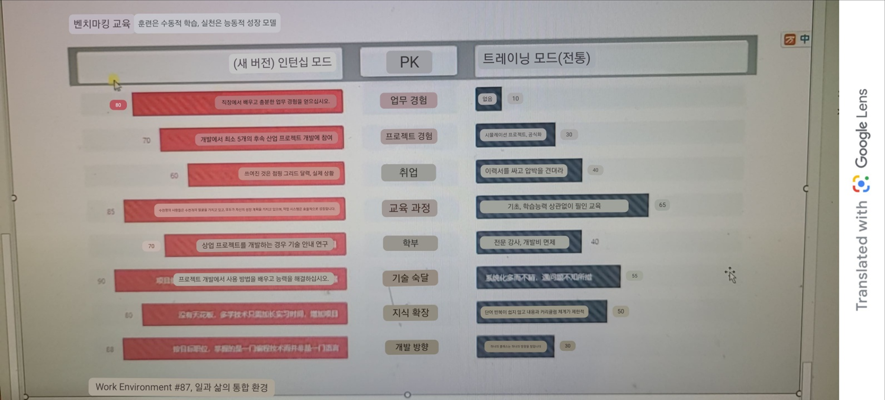
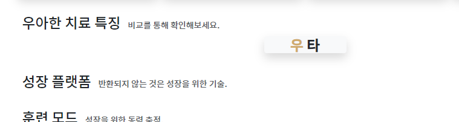
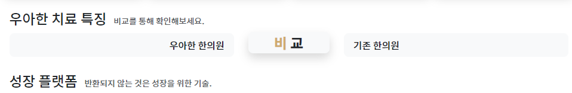
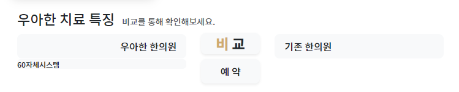

- 위와 같은 모양을 만들 예정이며, `auto | 2 | auto`의 칼럼을 채울 것이다.
```html
<div class="row">
    <div class="col"></div>
    <div class="col-2"></div>
    <div class="col"></div>
</div>
```


1. 가운데 col-2부분에 제목글자를 집어넣을텐데 후처리를 위해 `빈div`안에 개별 글자색 처리는 `b태그에 text-x`로 클래스를 준다
```html
<div class="row">
    <div class="col"></div>
    <div class="col-2">
        <div class="h4 text-center bg-light rounded-1 shadow">
            <b class="text-doctor">우</b> <b class="text-dark">타</b>
        </div>
    </div>
    <div class="col"></div>
</div>
```



2. 양측 col부분에, 비교할 대상들을 적어준다. 역시 꾸며줄 빈div안에 글자를 적는다.
    - 특정 속성이 필요하지 않으면 안에 적을 글자도 div로 준다
    - 회색배경에 rounded를 줘서, hover에 대비한다
    - **왼쪽col의 글자는 text-end, 오른쪽 col의 글자는 text-start 줘서 가운데 붙게 한다**
       - 이 때, pe-x  와 ps-x를 줘서, 너무 딱 붙지 않게 한다 
```html
<!-- 제목 row -->
<div class="row align-items-center">
    <div class="col">
        <div>
            <div class="bg-light text-end pe-3 rounded-3 fs-index py-2">
                우아한 한의원
            </div>
        </div>
    </div>
    <div class="col-2">
        <div class="h4 py-1 text-center bg-light rounded-3 shadow">
            <b class="text-doctor">비</b> <b class="text-dark">교</b>
        </div>
    </div>
    <div class="col">
        <div>
            <div class="bg-light text-start ps-3 rounded-3 fs-index py-2">
                기타 한의원
            </div>
        </div>
    </div>
</div>
```



3. 이제 각 row별 제목과 progress를 입력해야한다. 가운데 col-2부터 채워준다.
   - 가운데는 rounded + text-center sadhow bg-light p-x 를 빈div에 채워서 텍스트를 입력한다
   - 가운데 글자를 위해 col-4로 수정했다.
```html
<div class="row">
    <div class="col"></div>
    <div class="col-2">
        <div class="rounded-3 text-center fs-index shadow-sm p-2 bg-light">예약</div>
    </div>
    <div class="col"></div>
</div>
```

4. 좌/우 progress는 **div.w-100.progress.bg-light**안에 > 글자(bar지만 배경과 같은색으로 안보임+실제%의 나머지%로 width) + bar(다른배경 + 실제%만큼의 width차지) div로 구성된다.
```html
<div class="col">
    <div class="w-100 progress bg-light">
        <div>60</div>
        <div>실시간 자체예약</div>
    </div>
</div>
```


5. 일단 
