-예상 디자인
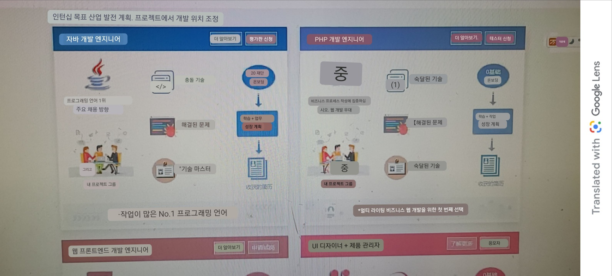

### 하단이미지와 상단 제목란
1. section의 배경색을 주고 시작한다
```html
<!--치료과정 시작-->
<section class="mt-4 bg-light">
```

2. sm12-md6을 차지하는 각 col에 대해서, **내부에는 `d-flex flex-column bg-white`로 각 box들을 `세로로 나열`할 준비한다**
```html
<div class="row mb-4">
    <div class="col-sm-12 col-md-6">
        <div class="d-flex flex-column bg-white shadow">
            <div>1</div>
            <div>2</div>
            <div>3</div>
        </div>
    </div>
    <div class="col-sm-12 col-md-6"></div>
    <div class="col-sm-12 col-md-6"></div>
    <div class="col-sm-12 col-md-6"></div>
</div>
```
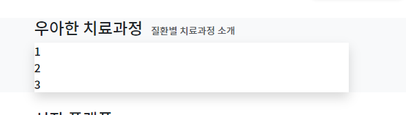

3. 맨 아래 요소에는 img.img-fluid로 배너처럼 마무리하도록 작성한다
```html
<div class="col-sm-12 col-md-6">
    <div class="d-flex flex-column bg-white shadow">
        <div>1</div>
        <div>2</div>
        <div class="">
            
        </div>
    </div>
</div>
```
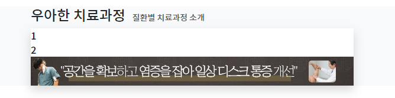

4. img-fluid로 w-100을 채우더라도 **부모div에 p-x 를 주면 그림에 대한 여백이 생긴다 -> `bg-white + p-x`를 같이줘서 `100% 그림을 감싸게` 만든다.**
    - 추가로 img에 rounded도 준다
```html
<div class="bg-white p-2">
    
</div>
```
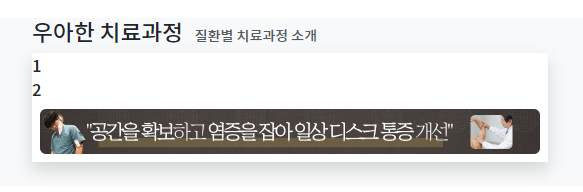


5. 첫번째 요소에는 제목(클릭), 더알아보기(클릭)을 각각div>a태그로 준다. 제목은 div>h5>a태그로 준다
```html
<div class="d-flex flex-column bg-white shadow">
    <div>
        <div><h5><a href="#">디스크 클리닉</a></h5></div>
        <div><a href="#">더 알아보기</a></div>
    </div>
    <div>2</div>
    <div class="bg-white p-2">
        
    </div>
</div>
```
6. 1번란 div에 배경색 + 전체적으로 text-white를 주고, 
   - 제목에 대한 a태그에는 decoration제거 + text-white 다시 한번 추가 까지 같이 준다.
   - 더알아보기도 a태그이지만 **btn으로 해결한다면, decoration-none을 처리안해줘도 된다. text-white는 한번 더 줘야한다**
   - 이 때, 배경색은 그림과 테마를 맞춘다.
   - 버튼은 rounded-0을 줘서 사각형을 유지한다. btn.btn-sm은 기본으로 작게 들어간다. border는 border-white로 색을 바꿔준다.
```html

<div class="text-white" style="background: #4B4542;">
    <div><h5><a class="text-decoration-none text-white " href="#">디스크 클리닉</a></h5></div>
    <div><a class="btn btn-sm border-white text-white rounded-0" href="#">더 알아보기</a></div>
</div>
```
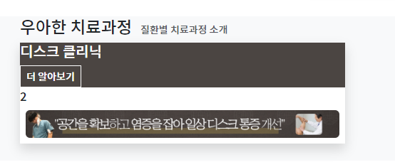


7. 제목과 더알아보기는 세로로 나열하기 위해 d-flex flex-row를 적용하고, flex-item을 우측으로 밀기 위해 제목div에 me-auto를 달아서 나머지를 오른족으로 밀어준다
```html
<div class="d-flex flex-row text-white" style="background: #4B4542;">
    <div class="me-auto"><h5><a class="text-decoration-none text-white " href="#">디스크 클리닉</a></h5></div>
    <div><a class="btn btn-sm border-white text-white rounded-0" href="#">더 알아보기</a></div>
</div>
```

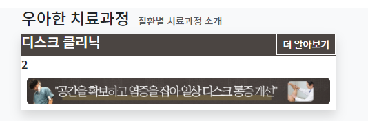

8. **수직가운데 정렬이 아니라, 위아래 여백을 다르게 반영해본다.**
   - 제일큰 제목에는, 위아래 여백이 다르도록,  pt-3/pb-2 + ps-4을 먼저주고
   - 알아보기버튼에는 p-2(위아래2), pe4를 각각 줘서 조절하고, 
   - 제목에 비해 버튼이 위쪽에 1을 더줘야하기 때문에, a태그에서 padding이 아닌 margin으로 1을 mt-1을 준다.
```html

<div class="d-flex flex-row text-white" style="background: #4B4542;">
    <div class="pt-3 pb-2 ps-4 me-auto"><h5><a class="text-decoration-none text-white" href="#">디스크 클리닉</a></h5></div>
    <div class="p-2 pe-4"><a class="mt-1 btn btn-sm border-white text-white rounded-0" href="#">더 알아보기</a></div>
</div>
```
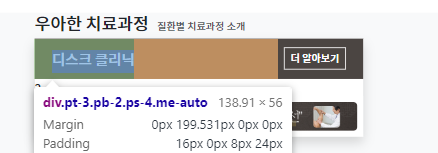

9. **`a태그 버튼`은 투명한 배경으로 배경색이 잇는데 `rgba`로 흰색 투명도를 줘서 배경을 입힌다.**
```html
<div class="p-2 pe-4">
    <a class="mt-1 btn btn-sm border-white text-white rounded-0" href="#" style="background:rgba(255, 2525, 225, 0.2);">더
        알아보기</a>
</div>
```

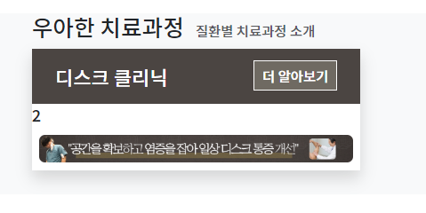


### 중간 컨텐츠 3단계
1. 중간 컨텐츠는 row로 3개를 배치하고, 각 flex-item마다 flex-column으로 3개를 만든다.
   - **style="color:"로 배경색과 동일한 글자색을 전체적으로 반영하자.**
   - **각 row 속 `모든 flex-item들`에게 `flex-fill` + `flex-column`을 줘서, 세로로 공간을 auto방식으로 나누어 가지도록 만든다.**
      - **나중에는 flex-fill때문에 배경이 안보여야한다?!**
```html
<!-- 치료과정 content -->
<div class="d-flex flex-row" style="color: #4B4542;">
    <!-- column이 될 각 row flex-item 3개 -->
    <div class="flex-fill flex-column text-center">
        1
    </div>
    <div class="flex-fill flex-column text-center">
        2
    </div>
    <div class="flex-fill flex-column text-center">
        3
    </div>
</div>
```
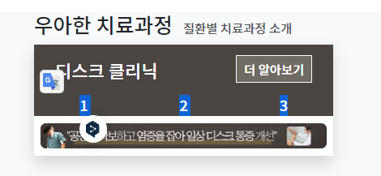


2. 첫 칼럼에는 **이미지 2개+ caption -> `figure > img+figcaption`조합을 2개를 배치한다.**
   - footer에 썼던 qrcode예시를 복사해와서 수정한다.
   - 그림을 수정한다. 이 때 img태그의 `img-thumbnail`을 삭제하면 여백 및 라운드 처리가 사라지게 된다.
   - **좁은지역을 벗어났으므로 max-width를 100 -> 150px까지 늘려주자.**
   - **링크가 필요하면 a태그로 figure태그를 감싼다.**
   - a>figure태그를 그대로 복사하면, **a태그가 inline이므로 가로로 배치되는데, `d-block`을 줘서 text-center와 함께, 1줄식 차지하게 만들어 2번째 a>figure을 다음줄로 보낸다**
    
```html
 <!-- 치료과정 content -->
<div class="d-flex flex-row" style="color: #4B4542;">
    <!-- column이 될 각 row flex-item 3개 -->
    <div class="flex-fill flex-column text-center">
        <a class="d-block" href="#">
            <figure class="figure mt-3">
                
                <figcaption class="figure-caption text-center">치료 전</figcaption>
            </figure>
        </a>
        <a class="d-block" href="#">
            <figure class="figure mt-3">
                
                <figcaption class="figure-caption text-center">치료 후</figcaption>
            </figure>
        </a>
    </div>
    <div class="flex-fill flex-column text-center">
        2
    </div>
    <div class="flex-fill flex-column text-center">
        3
    </div>
</div>
```
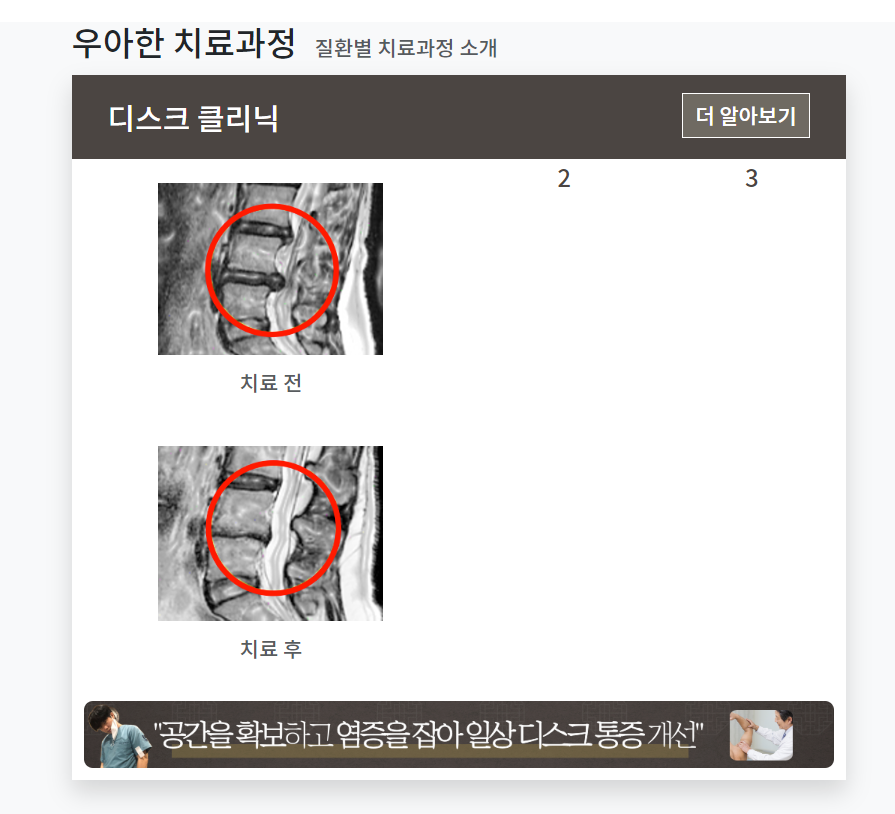


3. row의 2번재 item은 **그림에 caption이 우측에 들어가므로 `media`class를 활용하면 되는데 boostrap5에는 없다.**
   - 대신 d-flex로 만들어놓고, img는 축소안되는(`flex-shrink-0`) rounded / 글자는 확대(`flex-grow-1`)되는 div안에서  h6>a태그를 만들어준다.
   - img의 max-width는 75px로 잡는다./ 글자는 가운데 정렬되도록 my-auto를 사용했다.
   - img에서 글자쪽으로 div.flex-shrink-0에서 me-1을 준다
   - 부모인 div.d-flex는 mx-3, my-4, pb-3 정도로 서로의 간격을 유지한다.
```html
<div class="d-flex mx-3 my-4 pb-3">
    <div class="flex-shrink-0">
        
    </div>
    <div class="flex-grow-1 my-auto">
        <h6><a class="" href="#" style="color: #4B4542;">
            견인 추나
        </a></h6>
    </div>
</div>
```
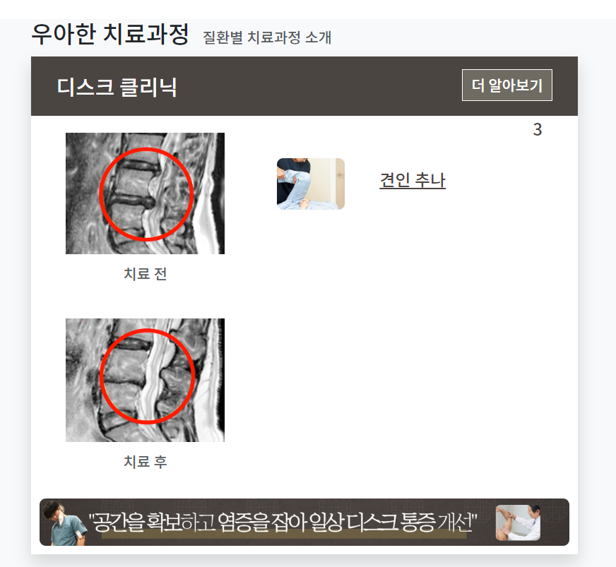

4. 이제 2개를 더 복사해서 3개로 칼럼방향 나열되게 만든다.


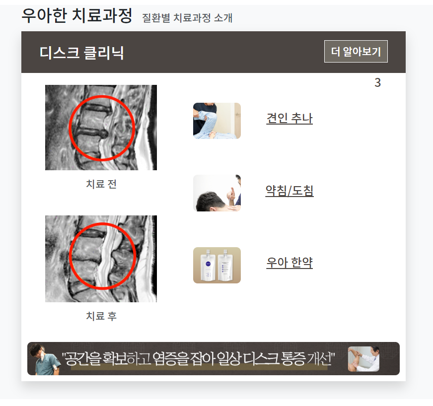


5. 3번째 row flex-item에는 화살표그림을 포함해서 다 나열할 것이다.
   1. flex-column에서 미리 fs-13을 준다.

6. 내부에서는 div.text-center.mt-3.pt-3으로 출발한다.
```html
<!-- 치료 설명 -->
<div class="flex-fill d-flex flex-column text-center fs-13">
    <div class="text-center mt-3 pt-3">
        <div class="p-2 rounded-circle text-dark" style="width: 80px;background: white;">
            ddd
        </div>
    </div>
</div>
```
7. 글자를 적을 때 말풍선을 rounded-circle로 줘도 되지만 여기선 생략했다.
```html
<!-- 치료 설명 -->
<div class="flex-fill d-flex flex-column text-center fs-13">
    <div class="text-center mt-3 pt-3">
        <!-- <div class="p-2 rounded-circle text-white text-shadow" style="width: 80px; background: #6D5F43;">-->
        <div class="p-2 text-white text-shadow">
            추나를 통한<br>
            공간확보
        </div>
    </div>
</div>
```

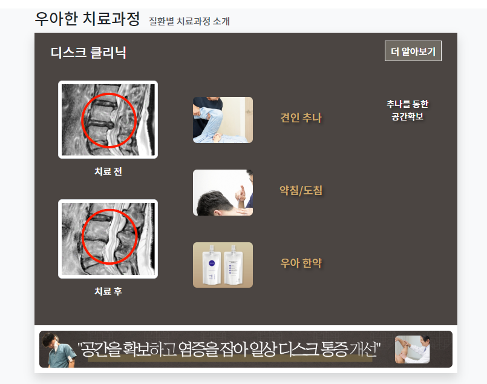


8. 화살표는 png로서 대충 세로길이를 맞춰서 구해놓고 img.img-fluid + max-width 조합으로 넣어준다.
   - 추가로 mx-auto로 넣어 가운데 정렬시킨다.
```html
<!-- 치료 설명 -->
<div class="flex-fill d-flex flex-column text-center fs-13">
    <!--<div class="p-2 rounded-circle text-white text-shadow" style="width: 80px; background: #6D5F43;">-->
    <div class="text-center mt-3 pt-3">
        <div class="p-2 text-white text-shadow">
            추나를 통한<br>
            공간확보
        </div>
    </div>
    
</div>
```
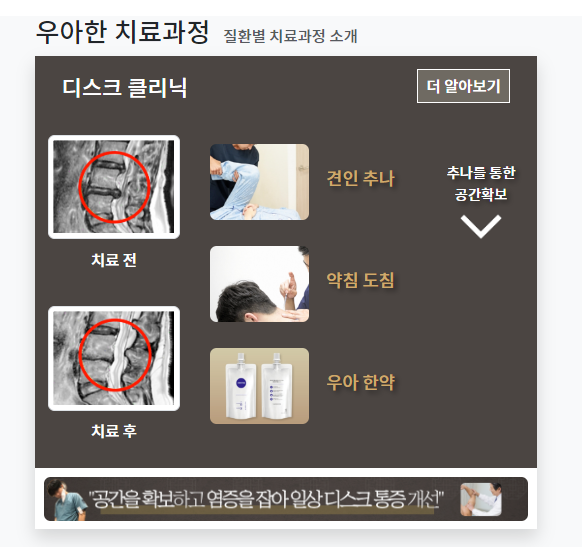
9. 이제 각 설명 + img를 복사해서 3단계로 만든다
   - mt-4를 mt-2로 바꾸고, py-2정도로 내부간격을 만들었다.
   - 필요하다면, img태그에 py-x를 줘서 간격을 만든다.

10. 이제 치료전후사진이 d-block으로서 전체를 차지하고 있는데, **border-bottom을 주며, border에 포함되지 않는 양쪽여백을 `mx-3`로 줘서 w-100에 여백을 준다**
- 아래쪽은 border-bottom없이 mx-3만 준다.
```html
``<!-- 치료과정 content -->
<div class="d-flex flex-row" style="background: #4B4542;">
    <!-- column방향으로 나열될 row flex-item 3개 -->
    <!-- 치료 전/후 -->
    <div class="flex-fill flex-column text-center">
        <a class="d-block mx-3 border-bottom border-light " href="#">
```
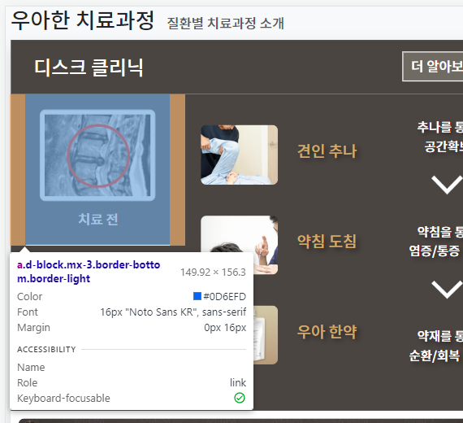


11. 이제 2번째 그림 왼쪽에 border-start를 주자
```html
<div class="flex-fill flex-column text-center my-3 border-start border-light">
    <!-- 추나-->
    <div class="d-flex mx-3 my-3 pb-3">
```

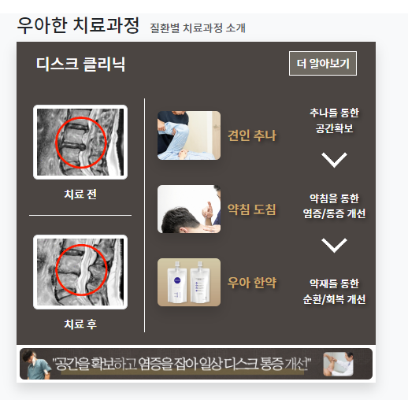
