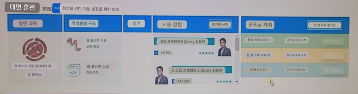
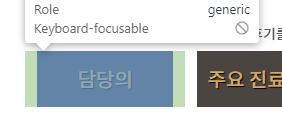
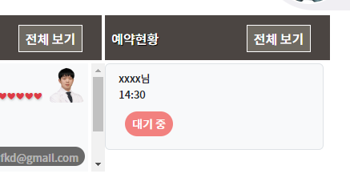

- 예상디자인


### header
1. row속 각 col에는 치료과정의 상단제목 을 복사해서 채워주고, col-3, col-4에만 a.btn을 남겨둔다. 
```html
<div class="row">
    <div class="col-2"></div>
    <div class="col-2"></div>
    <div class="col-1"></div>
    <div class="col-3"></div>
    <div class="col-4"></div>
</div>
```


2. 배경색을 변경해주고, 글자에 shadow를 없앤다?!
   - `버튼이 없는 col`들만 ps-4 me-auto의 **좌우여백을 제거**하고, justify-content-center로 flex내부의 inline글자/a태그를 가운데 정렬되게 한다.
```html
<div class="col-2">
   <div class="d-flex flex-row text-white bg-dark-subtle justify-content-center">
      <div class="pt-3 pb-2">
```
- 버튼이 있는 col-3,col-4는 글자부분의 ps-4와, 버튼부분의 pe-4를 2로 줄여준다.
```html
<div class="pt-3 pb-2 ps-2 me-auto">
    <h5 class="h5">
        <a class="text-decoration-none text-white text-shadow-lg " href="#">
            디스크 클리닉
        </a>
    </h5>
</div>
<div class="p-2 pe-2">
    <a class="mt-1 btn btn-sm border-white text-white rounded-0" href="#"
       style="background:rgba(255, 2525, 225, 0.2);">더 알아보기</a>
</div>
```

3. **칼럼 자체의 padding을 좌측은 삭제, 우측은 1만 주기**
   - 마지막만 ps-1만 준다.

```html

<div class="row">
<div class="col-2 ps-0 pe-1">
<div class="col-2 ps-0 pe-1">
<div class="col-1 ps-0 pe-1">
<div class="col-3 ps-0 pe-1">
<div class="col-4 ps-0">
```


4. 버튼의 우측여백은 pe-4로 수정해준다. 글자들을 모두 fs-index로 a태그에 지정해준다


### 각 내용
1. 일단 col별 간격을 header와 동일하게 유지하기 위해 복사한다
   - 내용 row를 몇개 복사해놓는다.
   - 각 row별 간격을 mt-1로 준다
```html
<!-- 내용 1-->
<div class="row mt-1">
    <div class="col-2 ps-0 pe-1">
    </div>
    <div class="col-2 ps-0 pe-1">
    </div>
    <div class="col-1 ps-0 pe-1">
    </div>
    <div class="col-3 ps-0 pe-1">
    </div>
    <div class="col-4 ps-0">
    </div>
</div>
```

2. 담당의 부분은 치료과정의 before/after를 만들던, a>figure 조합을 가져온다
   - figcaption에 h6.fs-13 사이즈로 원장이름을 적어주고, max-width를 80px로 바꿔준다
   - img-thumbnail 클래스도 삭제한다
   - figcaption text-center를 삭제하고 a태그로 옮겨줘서 이미지까지 가운데 정렬 시킨다
   - figure의 mt도 3정도로 줄여준다
   - 내용물 최고부모인 a태그에 bg-light를 주고, w-100으로 칼럼을 채워준다.(이미지는 max-width까지만 늘어남)
   - a태그의 mx-3을 제거해서, 헤더와 간격을 맞춘다
```html
<div class="col-2 ps-0 pe-1">
    <a class="d-block text-center bg-light w-100 " href="#">
        <figure class="figure mt-3">
            
            <figcaption class="figure-caption text-center">
                <h6 class="fs-13">조재성 원장</h6>
            </figcaption>
        </figure>
    </a>
</div>
```


3. 주요 진료방법은, 이미지+글자의 가로연결이므로, 진료과정 섹션의 media 대체 div를 복사해서 가져온다.
   - div의 mx-3을 제거하고, my-3대신 py-3으로 대체하여, bg-light추가후 배경이 차게 만든다. w-100을 추가하여 col을 가득차게 한다.
   - 패딩을 py-2로 줄여주고 상하를 똑같이 준다.
   - img의 shadow는 제거하고, max-width를 55px정도로 낮춘다
   - 글자부분에서 h6내부 a태그를 제거하고, 폰트는 fs-13으로 작게준다
   - 각각 mx-1로 위치가 바뀌어도 상관없게끔 mx-1씩을 준다
```html
<div class="col-2 ps-0 pe-1">
    <div class="d-flex py-2 bg-light w-100">
        <div class="flex-shrink-0 me-1">
            
        </div>
        <div class="flex-grow-1 my-auto pt-2">
            <h6 class="fs-13">
                재활
            </h6>
        </div>
    </div>
</div>
```


4. 하나 더 복사해서 앞의 담당의와 높이를 맞춘다
   - **이 때, widht에 따라 높이를 결정하는 img의 max-width를 조절해서 2개의 높이합을 담당의에 맞춘다.**
   - 조금 모자라게 만든 상태에서 아래것에서 mt-1정도로 간격을 만들어, 중간에 흰 line이 보이게 한다
   - 여기선 각각을 57.5px로 만들고, 중간에 mt-1을 줘서 맞췄다.
   - 그래도 안맞는다면, 조금 모자라게 준 뒤 아래쪽에 pb-x를 늘려줘서 맞춘다
```html

<div class="col-2 ps-0 pe-1">
    <div class="d-flex py-1 bg-light w-100">
        <div class="flex-shrink-0 me-1">
            
        </div>
        <div class="flex-grow-1 mx-1 my-auto pt-2">
            <h6 class="fs-13">
                재활
            </h6>
        </div>
    </div>
    <div class="d-flex py-1 bg-light w-100 mt-1">
        <div class="flex-shrink-0 me-1">
            
        </div>
        <div class="flex-grow-1 mx-1 my-auto pt-2">
            <h6 class="fs-13">
                추나
            </h6>
        </div>
    </div>
</div>
```


- img공간의 부모div에 가운데 정렬로 인해, 오른쪽에만 me-1로 줬던 것을 mx-1로 변경해준다.


5. 치료후기도 img+글자 가로조합이므로 media대체품인 주요진료를 복사해서 사용한다
   - 글자를 앞에, 이미지를 뒤쪽으로 변경하고, 이미지를 사용자로 바꿔야한다.
   - 일단 이미지크기는 똑같이 유지하여, height도 같이 차지하도록 놔둔다.
```html
<!-- 치료후기 -->
<div class="col-4 ps-0 pe-1">
    <div class="d-flex py-1 bg-light w-100">
        <div class="flex-grow-1 mx-1 my-auto pt-2">
            <h6 class="fs-clinic-desc">
                재활
            </h6>
        </div>
        <div class="flex-shrink-0 mx-1">
            
        </div>
    </div>
</div>
```


6. 글자부분에서는 수직가운데 정렬 my-auto을 지워주고, text-start로 좌측정렬시키며 내부 h6를 p>a태그안에 작은글씨체로 작성해준다.
   - 배경은 a태그가 아닌 p태그 w-100 + px-2 과 함께 넣어준다.

```html
<!-- 치료후기 -->
<div class="col-4 ps-0 pe-1">
   <div class="d-flex py-1 bg-light w-100">
      <div class="flex-grow-1 mx-1 pt-2 text-start">
         <p class="w-100 px-2 bg-clinic-1"><a href="#" class="text-decoration-none fs-13 text-truncate text-white">
            다이어트 클리닉
         </a></p>
      </div>
      <div class="flex-shrink-0 mx-1">
         
      </div>
   </div>
</div>
```


7. 양쪽으로 뻣어있을 날짜 <-> 평점은 `d-flex.flex-row.justify-content-between`으로 양옆으로 배치시킨다.
- div.small로 줘도 small태그 글씨체로 작아진다.
- 가운데 후기 부분을 p태그로 줬는데, text-truncate를 자신뿐만 아니라, 부모 div태그에도 해줘야 먹혔다

```html
  <!-- 치료후기 -->
<div class="col-4 ps-0 pe-1">
   <div class="d-flex  bg-light w-100">
      <div class="flex-grow-1 mx-1 text-start text-truncate">
         <!--클리닉 명-->
         <p class="w-100 px-2 bg-clinic-1 m-0">
            <a href="#" class="text-decoration-none fs-13 text-truncate text-white text-shadow ">
               디스크 클리닉
            </a>
         </p>
         <!--후기 -->
         <p class="w-100 fs-13 pb-1 m-0 text-truncate">
            친절하시고 좋았습니다^^ dddddddddddddddddㅋㅋㅋ
         </p>
         <!--날짜와 평가점수-->
         <div class="d-flex flex-row justify-content-between fs-13">
            <div class="small text-muted">📆 2023-07-05</div>
            <div class="small text-danger text-shadow-sm">❤❤❤❤❤</div>
         </div>
      </div>
      <div class="flex-shrink-0 mx-1">
         
      </div>
   </div>
</div>
```


8. 하지만 이제부터 복사되서, y-scroll을 만들 것이므로, 개별 1개크기에 맞추지말고, 후기란을 좀 더 길게 가져가자.
   - 치료후기 p태그에 text-truncate 대신 text-wrap으로 변경한다.
   - **2번째 후기는 글자뭉치전체를 text-end 정렬하지만, 후기p태그에 text-start를 넣어준다**
   - 추가로 클리닉 배경색도 바뀐다.
```html
<!-- 후기2. 우측정렬 -->
<div class="d-flex  bg-light w-100 py-1">
    <!-- 원장이미지 -->
    <div class="flex-shrink-0 mx-1">
        
    </div>
    <!-- 글자뭉치 -->
    <div class="flex-grow-1 mx-1 text-end text-truncate ">

        <!--클리닉 명-->
        <p class="d-inline-block rounded-pill  px-2 bg-dark m-0">
            <a href="#" class="text-decoration-none fs-13 text-truncate text-white text-shadow ">
                일반 치료
            </a>
            <span class="fs-13 text-white-50"> | 20대/남성</span>
        </p>

        <!--날짜와 평가점수-->
        <div class="d-flex flex-row justify-content-between fs-13 ps-1 pt-1">
            <div class="small text-danger text-shadow-sm">❤❤❤❤❤</div>
            <div class="small text-muted">2023-07-05 | xxxx님</div>
        </div>

        <!--후기 -->
        <p class="w-100 small py-1 ps-1 m-0 text-wrap fs-13 text-start">
            친절하시고 좋았습니다^^ dddddddddddddddddㅋㅋㅋ asdfasdfasdfsadf
        </p>
    </div>

</div>
```


9. 이제 치료후기 내용col에만 style로 height를 직접 주고, **`overflow-auto`를 준다. 안주면 height가 적용안된다.**
   - 135px을 주니 row와 일치하도록 작성되었다.
```html
<!-- 치료후기 -->
<div class="col-4 ps-0 pe-1 overflow-auto" style="height: 135px;">
```


10. 이제 예약현황판을 만들어보자.
   - **세로로 나열된 list를 col에서부터 `.list-group`으로 시작한다**
   - 내부에는 div.list-group-item을 부모로 배경+fs를 지정해준다.
   - rounded border가 자동으로 지정되어있다?
   - 일단은 div(block)으로요소들을 다 나열한다
   - 버튼은 헤더것을 가져와 수정한다
```html
<!-- 예약현황 -->
<div class="col-3 ps-0 list-group fs-13">
    <div class="list-group-item bg-light">
        <div>xxxx님</div>
        <div>14:30</div>
        <div class="p-2 pe-4">
            <a class="mt-1 btn btn-sm text-white bg-clinic-3 rounded-pill" href="#">
                대기 중
            </a>
        </div>
    </div>
</div>
```



11. list-group-item에서 각 내부요소들을 row방향 배치를 위해 `d-flex`를 걸어서 배치한다
   - 추가로 list-group에 list-group-item에 추가해서 보더radius를 없앤다
```html
<!-- 예약현황 -->
<div class="col-3 ps-0 list-group list-group-flush fs-13">
    <div class="list-group-item bg-light d-flex flex-row justify-content-between px-3 align-items-center">
        <div>xxxx님</div>
        <div>14:30</div>
        <div class="pe-4">
            <a class="btn btn-sm text-white rounded-pill fs-13 bg-clinic-3" href="#">
                대기 중
            </a>
        </div>
    </div>
</div>
```
12. 이제 2개를 더 복사하고 높이를 맞춘다.
13. 어차피 스크롤을 넣기 때문에, col에 height를 맞추고 overflow-auto로 준다
   - **기존에 col에 줬던 list-group옵션을 div를 만들어서 감싸서 따로 준다.**
```html
<!-- 예약현황 -->
<div class="col-3 ps-0 overflow-auto" style="height: 135px;">
    <!--예약list -->
    <div class="list-group list-group-flush fs-13">
        <!--예약1. -->
        <div class="list-group-item bg-light d-flex flex-row justify-content-between px-3 align-items-center">
```


