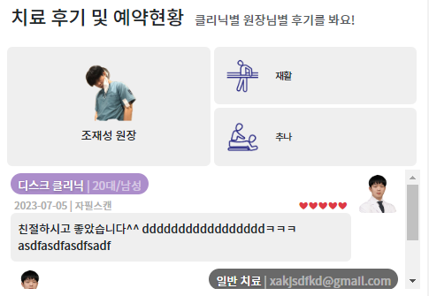
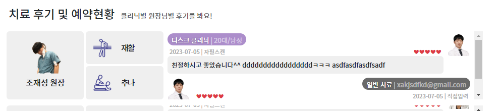
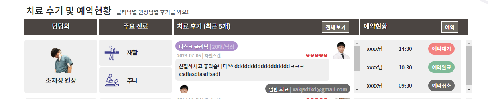
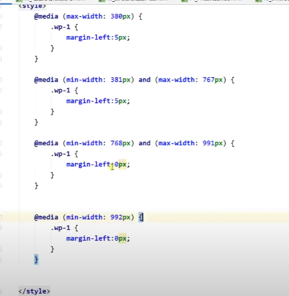

### 벤치마킹
1. 벤치마킹(우아한 특징)은 small화면에선 안보이게 한다
```html
<!--벤치마킹 섹션 시작-->
<section class="mt-4 d-none d-lg-block">
```

### 치료과정
1. 치료과정에서 sm-12 -> md-6로 갈때, 중간에 너무 좁아서 깨지게 된다
2. 맨 마지막 row flex-item(과정 설명)을 lg부터 block으로 나오게 한다?
    - md에서 깨져버리므로 충분히 커진 lg에서 나타나게 한다
```html
<!-- row 3. 치료 설명 -->
<div class="flex-fill d-flex d-none d-lg-block flex-column text-center fs-clinic-desc">
```

### 치료후기
1. `모바일에서 꼭 필요하지 않은 칼럼`인 주요진료 칼럼은  `xl일때만 보이게` 한다
   - `헤더`뿐만 아니라 `row들`에게도 똑같이 적용해줘야한다.
```html
<!--주요 진료-->
<div class="col-2 ps-0 pe-1 d-none d-xl-block">
```
2. row를 가리고 싶다면 `d-none d-xx-flex`로 나타나게 해야, col들이 flex-item으로서 row의 구성을 유지하게 된다.
   - 작은화면에서는 담당의+치료후기만 나타나면서 `header row를 숨긴다`
   - **하지만 `헤더를 숨기는 이유는 row의 col구성 파괴(작을 때 다음줄)`일 때일 것이다.**
   - **`보통` d-none d-xx-flex는 헤더가 아닌 데이터 `row1줄 전체를 숨길때 사용`한다**
      - 나는 row를 숨기진 않으므로, 일단 헤더를 감출때 사용해본다.
```html
<!-- 헤더 -->
<div class="row d-none d-xl-flex">
```


2. `기본 col-비율 -> xl이후의 비율로 변`했으니, 그 전까지에선 **안보이는 칼럼들 빼고 비율합12를 맞춰줘야한다.**
   - 기존 2+2+5+3
```html
 <!-- 담당의 -->
<div class="col-2 ps-0 pe-1">
   
<!-- 치료후기 -->
<div class="col-5 ps-0 pe-1 overflow-auto bg-white rounded" style="height: 135px;">

<!-- 예약현황 -->
<div class="col-3 ps-0">
```
   - 바뀐것 xl이후 2+2+5+3 -> `그 전까지는` (2+1) + (0) + (5+4) + (0)
```html
<!-- 담당의 -->
<div class="col-xl-2 ps-0 pe-1">
<div class="col-3 col-xl-2 ps-0 pe-1">
<!-- 치료후기 -->
<div class="col-xl-5 ">
<div class="col-9 col-xl-5"> 
```
3. 주요진료를 살리고, 예약후기는 다음줄로?
- 2253 -> 336(x) 으로 가운데 주요진료를 살린다

4. 진료후기 전의 , 담당의+주요진료 2개를, lg-2 + lg-2 를 6 6으로 시작하게 한다 
   - 담당의 col속 부모a태그에 h-100도 추가한다
   - 진료후기는 12로 시작하게  해서 lg에서 자리 잡는다.
   - 즉 6+6/12 -> 2+2+8 -> 2+2+5+3 이 된다. 
```html
<!-- 담당의 -->
<div class="col-6 col-md-6 col-lg-2 ps-0 pe-1">
<!-- 주요진료 -->
<div class="col-6 col-md-6 col-lg-2 ps-0 pe-1">

<!-- 치료후기 -->
<div class="col-12 col-md-12 col-lg-8 col-xl-5 ps-0 pe-1 overflow-auto bg-white rounded " style="height: 135px;">

<!-- 예약현황 -->
<div class="d-none d-xl-block col-3
```






5. col들에 margin을 주면, 맞춰진 데서 넘어가버릴 것이다. 주더라도 col-12를 차지하는 곳에서 줬다가. 뭉치는 곳에서는 풀어야한다?!
   - col-12인 구간만 찾아서 .wp-x로 주자
   

6. height도 맞춰서 조절할 수 있다.
   - **치료후기 고정된 height를 가진 col에서 선택자를 주고 맞추자. -> 작은화면에서 col-12이므로 더 늘리자.**
   - 먼저 bootstrap 중단점의 내용을 복사해와서 아래와 같이 수정한다.
```css
    @media (min-width: 380px) {
    ...
}

@media (min-width: 381px) and (max-width: 767px) {
    ...
}

@media (min-width: 768px) and (max-width: 991px) {
    ...
}

@media (min-width: 992px) {
    ...
}
```
- col에 특정 선택자`review-h`를 주고, lg보다 더 큰부분에서 xl일때의 높이를 그대로 준다.
```html
<!-- 치료후기 -->
<div class="col-12 col-md-12 col-lg-8 col-xl-5 ps-0 pe-1 overflow-auto bg-white rounded review-h" style="height: 135px;" ...>
```
```css
@media (min-width: 992px) {
    .review-h {
        height: 135px;
    }
}
```
- 이제 더 작은범위에서 135보다 더 크게 준다
```css    
@media (max-width: 380px) {
    .review-h {
        height: 180px !important;
    }
}

@media (min-width: 381px) and (max-width: 767px) {
    .review-h {
        height: 180px !important;
    }
}

@media (min-width: 768px) and (max-width: 991px) {
    .review-h {
        height: 180px !important;
    }
}

@media (min-width: 992px) {
    .review-h {
        height: 135px;
    }
}
```

- 특정범위아래에서는 동일하므로 젤 큰 max-width만 남긴다?
- 패딩까지 같이 추가해준다.
```css
@media (max-width: 991px) {
    .review-h {
        height: 180px !important;
        padding: 5px!important;

    }
}

@media (min-width: 992px) {
    .review-h {
        height: 135px;
    }
}
```


### 치료후기 swiper 적용하기
1. col <->  후기 div.flex 사이에 `div.swiper.xxxxSwiper` > `div.swiper-wrapper` > 개별 content마다 `div.swiper-slide` 씌우기
2. swiper안에 `<div class="swiper-pagination"></div>` 도 위치 siper-wrapper와 동일한 레벨로 잡아주기
3. script에 `.xxxxSwiper`로 초기화해주기
```html
<!-- 치료후기 swiper-->
<script>
    var reviewSwiper = new Swiper(".reviewSwiper", {
        slidesPerView: 1,
        centeredSlides: true,
        spaceBetween: 3,
        grabCursor: true,
        // loop: true,
        // autoplay: {
        //     delay: 6500,
        //     disableOnInteraction: false,
        // },
        pagination: {
            el: ".reviewSwiper .swiper-pagination",
            clickable: true,
        },
    });
</script>
<!-- 치료후기 swiper 끝-->
```
