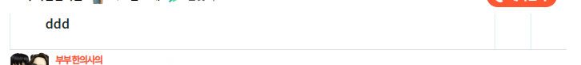
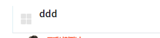
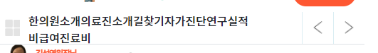
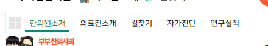
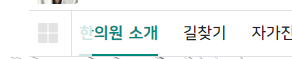

### 디자인
1. 검색엔진을 위해 blind css를 만든다

```css
.blind {
    position: absolute;
    overflow: hidden;
    clip: rect(0 0 0 0);
    margin: -1px;
    width: 1px;
    height: 1px;
}
```

2. 틀을 잡는다.

```html
<!-- cast 메뉴 시작-->
<style>

</style>
<nav>
    <div class="container">
        <h3 class="blind">탭 메뉴</h3>
        <div>
            <!-- 전체 | 구역 | 왼쪽 | 오른쪽-->
            <button>
                <span class="blind">전체 메뉴</span>
            </button>
            <div>

            </div>
            <button>
                <span class="blind">이전 메뉴</span>
            </button>
            <button>
                <span class="blind">다음 메뉴</span>
            </button>
        </div>
    </div>
</nav>
<!-- cast 메뉴 끝-->
```

2. 버튼은 inline-block이 될 건데, inline-block끼리 붙으면 이상한 공간이 생기므로 `float-left`를 활용한다
    - **css + click기능을 위해 button에 `id`를 각각 배정해준다.**

```html

<div>
    <!-- 전체 | 구역 | 왼쪽 | 오른쪽-->
    <button id="tab-all">
        <span class="blind">전체 메뉴</span>
    </button>
    <div id="tab-list">

    </div>
    <button id="tab-prev">
        <span class="blind">이전 메뉴</span>
    </button>
    <button id="tab-next">
        <span class="blind">다음 메뉴</span>
    </button>
</div>
```

- 이제 각 id로 선택자를 잡아서, inline-block 대신 float: left로 배치한다.
- bootstrap으로서 class로 `float-start`를 배정했다.

```html
<!-- 전체 | 구역 | 왼쪽 | 오른쪽-->
<button id="tab-all" class="float-start">
    <span class="blind">전체 메뉴</span>
</button>
<div id="tab-list" class="float-start">

</div>
<button id="tab-prev" class="float-start">
    <span class="blind">이전 메뉴</span>
</button>
<button id="tab-next" class="float-start">
    <span class="blind">다음 메뉴</span>
</button>
```

3. float-start 요소들을 받아줄 부모의 빈div에는 `inline-block` 및 `w-100`을 준다.
    - block format context를 생성한다고 한다. 그래야 다음 것들과 연결될 수 있다?

```html
<!-- tab 메뉴 -->
<div class="d-inline-block w-100">
    <!-- 전체 | 구역 | 왼쪽 | 오른쪽-->
    <button id="tab-all" class="float-start">
```

- 전체영역의 bottom에 보더를 추가해준다

```html

<div class="d-inline-block w-100 border-bottom">
```

4. 버튼들과 scroll공간 의 높이들을 css로 정해준다. (공통이라서 inline style안함.)

```html

<style>
    #tab-all, #tab-list, #tab-prev, #tab-next {
        height: 45px;
    }
</style>
```

- 4개를 묶었으니, float-start class도 그냥 css로 준다.

```css
 #tab-all, #tab-list, #tab-prev, #tab-next {
    height: 45px;
    float: left;
}
```

5. 공간빼고 버튼들만 width를 height와 동일하게 준다.
    - 이 때, 버튼들의 border를 강제로 제거하고, border-left만 준다.
    - 버튼들의 배경은 white로 준다

```css
/* 버튼들 */
#tab-all, #tab-prev, #tab-next {
    width: 45px;
    border: none;
    border-left: 1px solid #dbeef3;
    background: white;
}
```

6. **이 때, float-left 정렬item들에, `width 정해진 버튼들을 제외한 공간`을 list가 다 차지하려면 `부모에 flex, 해당자식에는 flex-grow:1`을 줘야한다**
    - d-inline-block을 `d-inline-flex`로 변경한 뒤, #toggle-list에 `flex-grow-1`을 선택자로 준다

```html
<!-- tab 메뉴 -->
<div class="d-inline-flex w-100 border-bottom">
    <!-- 전체 | 구역 | 왼쪽 | 오른쪽-->
    <button id="tab-all">
        <span class="blind">전체 메뉴</span>
    </button>
    <!-- scroll 공간-->
    <div id="tab-list" class="flex-grow-1">
        ddd
    </div>
```



7. 이제 각 버튼에 img들을 `span태그`의 background로 공통으로 넣어주는 선택자 `tab-icon`을 만들어 입력해주고, **부모button id를 다르게 각각 준다**
    - span은 `absolute`, top + left 50% + transform: translate(-50%, -50%) 조합으로 가운데 위치시킨 뒤 에서 bg이미지 + cover로 준다.
    - 이 때, w,h를 부모에 대해 50%로 줬다. 직접 픽셀을 정해도 된다.
    - **그러려면 부모인 button들 자체가 `relative`여야한다**
    - **버튼들은 padding도 삭제해준다**

```css
/* 버튼들 */
#tab-all, #tab-prev, #tab-next {
    width: 45px;
    padding: 0;

    border: none;
    border-left: 1px solid #dbeef3;
    background: white;

    position: relative;

}
```

```html

<button id="tab-all">
    <span class="blind">전체 메뉴</span>
    <span class="tab-icon"></span>
</button>
<button id="tab-prev">
    <span class="blind">이전 메뉴</span>
    <span class="tab-icon"></span>
</button>
<button id="tab-next">
    <span class="blind">다음 메뉴</span>
    <span class="tab-icon"></span>
</button>
```

- 이제 각 버튼의 id를 잡고, 그 하위 .tab-icon의 span에 배경을 준다.

```css
    /* 버튼 icon 그림 삽입 */
#tab-all .tab-icon {
    position: absolute;

    left: 50%;
    top: 50%;
    transform: translate(-50%, -50%);

    width: 40%;
    height: 40%;

    background-image: url("images/tabmenu/menu.svg");
    background-size: cover;
}
```



- 화살표 좌우측이미지는 width 30% / 40%로 맞춰준다


8. 이제 scroll공간에 ul>li태그로 데이터들을 집어넣는다

```html
<!-- scroll 공간-->
<div id="tab-list" class="flex-grow-1">
    <ul>
        <li>한의원소개</li>
        <li>의료진소개</li>
        <li>길찾기</li>
        <li>자가진단</li>
        <li>연구실적</li>
        <li>비급여진료비</li>
    </ul>
</div>
```

9. 이제 ul태그에 list-style을 제거 + m0p0 을 지정한 뒤, 각 li태그에는 `float:left`를 걸어준다

```css
    /* scroll 공간 스타일 */
#tab-list ul {
    list-style: none;
    margin: 0;
    padding: 0;
}

#tab-list li {
    float: left;
}
```



10. 각 li요소들의 간격을 css로 추가한다

```css
#tab-list li {
    float: left;

    margin-right: 10px;
    padding: 10px 7px 0;
}
```

11. **이제 다음줄로 넘어감 방지를 해야하는데, 기본은 `height`가 정해져있을 때의 `white-space:nowrap; overflow:hidden;`이다.**

- height를 주지 않으면 ul자체의 높이가 늘어난다. **다음줄방지를 했찌만, height가 없는 ul태그가 자체높이를 늘려버린다.**

```css
/* scroll 공간 스타일 */
#tab-list ul {
    list-style: none;
    margin: 0;
    padding: 0;

    height: 45px;
    white-space: nowrap;
    overflow: hidden;
}
```

- **문제는, scroll하려면, 다음줄로 아예 안넘어가야하는데, `ul태그는 공간의 개념이 없이 넘어가버린다`**
    - scroll 공간이 flex-grow-1을 차지하고 있는 상황에서, **flex-grow된 공간을 차지할 `ul태그를 감쌀 중간공간`이 추가로 필요하다**
    - **나는 따로 공간을 마련하지 않고 `flex-grow-1`되는 flex-item을 다시 `d-flex`로 flex-layout으로 만들어버린 뒤, 공간책임자로서 overflow-hidden을 넣어준다**
    - **ul태그는 그에 대한 flex-item이지만 너비조정이 안되도록 `flex:none;`속성을 추가해서 nowrap이 적용되게 하였다.**
    - **flex:none;으로 대체된 white-space:nowrap;은 제거해주고, height도 공간div에 옮긴다**

```css
#tab-list {
    position: relative;

    height: var(--tab-height);
    display: flex;
    overflow: hidden;
}

#tab-list ul {
    flex: none;
}
```

12. 이제 하이라이트를 만들기 전에, 폰트등을 정리한다

- 나눔스퀘어 : https://github.com/moonspam/NanumSquare

```css
@import url(https://cdn.jsdelivr.net/gh/moonspam/NanumSquare@2.0/nanumsquare.css);

:root {
    --tab-font-family: 'NanumSquare', sans-serif;
}

#tab-list ul {
    font-family: var(--tab-font-family);
    font-weight: 700;
}
```

```html

<div id="tab-list" class="flex-grow-1 fs-13">
```

13. 높이를 모두 45-> 35px로 변경한다

```css
#tab-all, #tab-list, #tab-prev, #tab-next {
    float: left;
    height: 35px;
}

#tab-all, #tab-prev, #tab-next {
    width: 35px;
}

#tab-list ul {
    height: 35px;
}
```

- :root {} 에 변수로 저장해놓고 3곳에서 활용하게 한다

```css
    :root {
    --tab-height: 35px;
}

#tab-all, #tab-list, #tab-prev, #tab-next {
    float: left;
    height: var(--tab-height);
}
```

- 그에 따라 tab-icon의 width/height도 조정해준다.

14. 이제 hover시 굵기변화 / on(직접), active(js라이브러리)시 변화를 정의해준다.

- 추후 내부의 `li` -> `a`태그로 변화될 수 있다.

```css
#tab-list li:hover {
    font-weight: 1000;
}

#tab-list li.on, #tab-list li.active {
    font-weight: 1000;
    border-bottom: 3px solid var(--color-submain);
    color: var(--color-submain);
}
```

```html

<li class="on">한의원소개</li>
```



15. 이 때 bottom의 bordre는, padding까지를 먹는데, tab-height를 적용해서 그 때만큼은 높이가 생겨서 bottom의 border도 height이후로 자리잡게 한다

```css
#tab-list li.on, #tab-list li.active {
    font-weight: 600;
    border-bottom: 2px solid var(--color-submain);
    color: var(--color-submain);

    height: var(--tab-height);
}
```

16. 크기에 따라 변해야하는 ul의 height + 버튼 width + 우측간격 + 글자크기는 root에 반응형으로 넣어주고 사용한다

```css
:root {
    --tab-height: 45px;
    --tab-margin: 25px;
    --tab-font-size: 1.1rem;
}

@media screen and (max-width: 776px) {
    :root {
        --tab-height: 35px;
        --tab-margin: 15px;
        --tab-font-size: 13px;
    }
}

.fs-tab {
    font-size: var(--tab-font-size);
}

#tab-all, #tab-list, #tab-prev, #tab-next {
    float: left;
    height: var(--tab-height);
}
```

17. 이제 양옆으로 가리는 효과를 #toggle-list 속 ul 형제로 양옆에 div.opacity.left .right를 생성해서 css로 준다.

- 공통인 클래스1개 (opacity) 좌/우 선택 클래스 1개씩으로 2개 클래스로 구성된다.

```html
<!-- scroll 공간-->
<div id="tab-list" class="flex-grow-1 fs-tab border-start ps-2">
    <!-- 가리개 -->
    <div class="opacity left"></div>
    <ul>
        <li class="on">한의원 소개</li>
        <li>길찾기</li>
        <li>자가진단</li>
        <li>치료후기</li>
        <li>연구실적</li>
        <li>비급여진료비</li>
        <li>자주묻는 질문</li>
    </ul>
    <div class="opacity right"></div>
</div>
```

- 각각은 left:0, right:0으로 시작하는 absolute 아이템들이다.
- 그럴려면 부모인 ul은 relative여야, 자식 가리개들이 absolute로 덮을 수 있다

```css
    /* 가리개 */
#tab-list {
    position: relative;
}

.opacity {
    opacity: .8;
}

.opacity.left {
    position: absolute;
    left: 0;
    top: 0;
    height: var(--tab-height);
    width: 20px;

    background: white;
}

.opacity.right {
    position: absolute;
    right: 0;
    top: 0;
    height: var(--tab-height);
    width: 20px;

    background: white;
}
```




### draggable 적용하기
1. 필요 js를 2가지를 추가한다.
```html
<!-- tab메뉴: gsap 전체 대신 필수 TweenMax + Draggable 추가 -->
<script src="js/TweenMax.min.js"></script>
<script src="js/Draggable.min.js"></script>
```
2. Draggable을 만들기 위해선, ul의 부모공간을 bounds옵션에, ul태그를 target으로 `Draggable.create()`를 해주면 된다.

```html
<!-- tab메뉴 draggable js -->
<script>
    $(function () {
        //1. ul의 부모공간을 bound될 공간으로서 먼저 찾고
        var $tabBound = $("#tab-list");
        //2. 내부 ul태그를 target으로 찾는다.
        var $tabTarget = $tabBound.find("ul");


        Draggable.create($tabTarget, {
            type: "x",
            bounds: $tabBound,
            throwProps: true,
            onClick: function (e) {
            },
            onDragEnd: function () {
                // console.log("drag ended");
            }
        });
    })
</script>
```


3. 이제 클릭이 active효과를 내주기 위해선, 각각의 li속에 a태그를 가지고 있도록 변환하고, href = uri 가 같으면 `on` class를 입혀준다.
    - a태그에 text-decoration-none을 걸어, li에 걸어주었던 hover, on, active를 모두 `li>a`태그로 변경한다.

```css
#tab-list li > a {
    text-decoration: none;
    color: black;
}

#tab-list li > a:hover {
    /*font-weight: 1000;*/
    color: var(--color-submain);
}

/* 색 입히기 */
#tab-list li > a.on, #tab-list li > a.active {
    /*font-weight: 1000;*/
    /*height: var(--tab-height);*/
    /*border-bottom: 2px solid var(--color-submain);*/
    color: var(--color-submain);
}
```

### 선택된 a태그의 동적 위치 조정하기
- 4번 주석을 따라간다.

```js
$(function () {
    //1. ul의 부모공간을 bound될 공간으로서 먼저 찾고
    var $tabBound = $("#tab-list");
    //2. 내부 ul태그를 target으로 찾는다.
    var $tabTarget = $tabBound.find("ul");
    //3. 현재 창의 uri(pathname)을, 해당 a태그의 href가 포함하고 있으면 on을 준다.
    var uri = window.location.pathname; // console.log(uri) /*/bootstrap/index.html*/
    // 4. 추가로 TweenMax를 이용해, 동적으로, on된 a태그로 위치를 drag위치를 옮긴다
    // (1) ul태그(tabTarget)의 outerWidth / 부모div태그(tabBound)의 innerWidth, outerWidth를 각각 구해놓고
    // (2) a태그들 중 선택된 (this)의 offsetLeft, outerWidth -> eventPoint, textEndPoint를 구해놓은 뒤,
    //     on에 해당하는 a태그에 대하여, 공식을 적용해, 당겨온다
    //    -> 확인은 모바일화면에서 뒤쪽의 요소 uri를 index.html로 잡아서 확인한다.
    var targetOuterWidth = $tabTarget.outerWidth();
    var boundInnerWidth = $tabBound.width();
    var boundOuterWidth = $tabBound.outerWidth();


    $tabTarget.find("a").each(function () {
        //3-2. 현재 창의 uri(pathname)을, 해당 a태그의 href가 포함하고 있으면 on을 줘서 -> css가 작동하게 한다.
        // console.log($(this).attr("href")); /*http://localhost:63342/bootstrap/index.html*/
        if ($(this).attr("href").includes(uri)) {
            $(this).addClass("on");

            //4-2.
            var offsetLeft = $(this).offset().left;
            var aOuterWidth = $(this).outerWidth();
            var eventPoint = offsetLeft - aOuterWidth / 2;
            var textEndPoint = offsetLeft + aOuterWidth / 2;

            if ((boundInnerWidth > targetOuterWidth) || boundInnerWidth / 2 > textEndPoint) {
                // 왼쪽 가장자리
            } else if ((boundInnerWidth < targetOuterWidth) && (targetOuterWidth - boundInnerWidth / 2 < eventPoint)) {
                // 오른쪽 가장자리
                TweenMax.to($tabTarget, .1, {x: -(targetOuterWidth - boundInnerWidth)});
            } else {
                // 동적인 자리변동
                TweenMax.to($tabTarget, .1, {x: -((offsetLeft - boundInnerWidth / 2))});
            }
        }
    });
```

### on버튼을 기준으로 이전/다음 버튼 클릭구현
1. 일단 현재 `.on`을 가진 `a태그`의 가장 가까운, li태그(부모)의 index를 찾아놓고,
2. 전체 li태그의 갯수를 찾아놓는다.
```js
// 5. 이전/다음버튼
var currentLiIndex = $tabTarget.find(".on").closest("li").index();
var liLength = $tabTarget.find("li").length;
// console.log(currentLiIndex, liLength) // 5(0~6), 7
```
3. 버튼 2개를, id를 통해 element를 잡고 .on("click")을 걸어준다. 이 때, preventDeafult()도 해준다.
    - **현재 index가 줄이다보면 0에서 내릴 경우 -> 현재index를 length로 주고 넘어가게 한다?. 그렇지않으면 1개를 깍는다.**
    - 깍인 index를 통해, li태그들을 찾아서, 해당index의 a태그의 href로 `location.href`로 이동한다.
    - test는 log로 찍어보고, 넘어가게 한다. (넘어가버리면 로그 안보임)
```js
var $prev = $("#tab-prev");
var $next = $("#tab-next");

$prev.on("click", function (e) {
    e.preventDefault();

    if (currentLiIndex < 0) {
        currentLiIndex = liLength;
    } else {
        currentLiIndex--;
    }
    //test
    console.log($tabTarget.find("li").eq(currentLiIndex).find("a").attr("href"));
    location.href = $tabTarget.find("li").eq(currentLiIndex).find("a").attr("href");
})
```
```html
<li>
    <a href="prev">연구실적</a>
</li>
<li>
    <a href="http://localhost:63342/bootstrap/index.html">비급여진료비</a>
</li>
<li>
    <a href="next">자주묻는질문</a>
</li>
```

4. next의 경우, index가 마지막인덱스( length-1)보다 크거나 같다면, 처음으로 돌아가야하므로 index = 0으로 가도록 한다 그외에는 올린다. 
```js
$next.on("click", function (e) {
    e.preventDefault();

    if (currentLiIndex >= liLength - 1) {
        currentLiIndex = 0;
    } else {
        currentLiIndex++;
    }
    location.href = $tabTarget.find("li").eq(currentLiIndex).find("a").attr("href");
})
```
