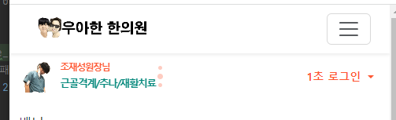

### header (logo, slogen, tool btn)
1. logo는 row>col 아래에 `a>img`로 틀을 잡으며, **img.img-fluid로 무작정 다 채우는게 아니라, `max-width: 직접지정px` + `height:auto;`조합이다.**
    - **부모 컨테이너를 가득채우는 경우가 아니라면, `style=""`로 max-width를 정하고 -> height는 자동**
```html
<div class="col">
    <a href="#">
        
    </a>
</div>
```
2. header>container>row>col 3개 중 2번째인 slogen은 `blockquote.blockquote.text-center > p태그`로 만든다
    - `.blockquote`는 마진바텀 + font-size만 결정해준다
    - 일단은 col들을 수직정렬하진 않고.. slogen 내부에서 logo의 높이에 따라 `pt-x`으로 배너와 높이를 직접 맞춘다
```html
<div class="col pt-1">
    <blockquote class="blockquote text-center">
        <p>케어 받고 싶은 날...</p>
    </blockquote>
</div>
```


3. tool btn란의 `div.text-end`로 감싼,  2개의 버튼은 dropdown btn-group예제로 이루어진 dropdown 2개를 사용한다
    - 내부 div.btngroup은 inline-flex인데, 부모에서 text-end로 정렬한다
    - button에 btn-sm을 줘서 드랍다운을 작게 만든다.
    - 드랍다운 내부는 fs-13으로 준다
    - logo, slogen과 높이를 직접 맞추기 위해 div.text-end에 pt-1을 준다


4. header의 높이를 nav와 **mt-4 -> mt-2로 줄이는 대신, row에 py-2를 추가하여, 위아래 간격을 줄 수 있게 한다. `이를 통해, 작은화면에서 사라질 때, 같이 사라져버린다?!`**
5. row에서 3개 col에 대해 align-items-center로 수직정렬하고, col의 개별  pt-를 조정한다
   - slogen만.. 수직정렬이 p태그 때문에 안먹는 듯하다. 여기에 나머지들을 pt-x로 맞춘다

```html
<div class="row py-2 align-items-center">
    <div class="col">
        <a href="#">
            
        </a>
    </div>
    <div class="col pt-1">
        <blockquote class="blockquote text-center">
            <p>케어 받고 싶은 날...</p>
        </blockquote>
    </div>
    <div class="col">
        <div class="text-end">
            <div class="btn-group">
                <button type="button" class="btn btn-sm  dropdown-toggle bg-transparent text-main fw-bold border-0"
                        data-bs-toggle="dropdown"
                        aria-expanded="false">
                    1초 로그인
                </button>
                <ul class="dropdown-menu">
                    <li><a class="dropdown-item fs-13" href="#">카카오톡 로그인</a></li>
                    <li><a class="dropdown-item fs-13" href="#">네이버 로그인</a></li>
                    <li><a class="dropdown-item fs-13" href="#">구글 로그인</a></li>
                    <li>
                        <hr class="dropdown-divider">
                    </li>
                    <li><a class="dropdown-item fs-13" href="#">빠른 회원가입</a></li>
                </ul>
            </div>

        </div>
    </div>
```
#### 화면 줄일 시, 가운데 slogen만 사라지도록
1. d-none 시작 d-lg-block으로 lg부터만 나오게 한다
```html
<div class="col pt-2 d-none d-lg-block">
    <blockquote class="blockquote text-center">
        <p class="text-truncate ">한의학과 함께하는 생활</p>
    </blockquote>
</div>
```

#### logo자리에  horizontal card 삽입하기
1. card예시를 가져오고, div.card에 `.border-0`과 `.flex-row`를 추가해서 이미지<->card-body가 가로나열되게 변경한다
2. 예시이미지를 img태그에 넣는다
3. div.card의 style속 width를 제거하고, img.card-img-top의 반응형 w-100를 style=을 통해 width를 `div.card에 대한 img.card-img-top가 %로 max-width + height auto`로 지정해주면, 상하만 꽉차게 되는데, `.my-auto`를 class=에 추가하여 수직 가운데 정렬시킨다  
4. div.card-body를 `flex-column`으로 만들어 세로로 나열시킨 다음, `justify-content-center`하면, 수직 가운데 정렬된다. 
5. 이제 h5.card-title 및 p.card-text에, 일단 1줄은 넘기면 안되므로 `.text-truncate`를 부모인 div.card-body까지 같이 다 준다.
6. card-body의 p-0로 여백을 줄이고 앞쪽 ps-2만 준다. 각 h, p태그에는 사이에만 여백을 mb-1, my-0으로 들어가게 한다.
7. 넘쳐나는 content를 잡기 위해 col -> col-4로 지정해준다.
```html
<!--top left banner by splide-->
<div class="col-4">
    <div class="card border-0 flex-row ">
        
        <div class="card-body d-flex flex-column justify-content-center text-truncate p-0 ps-2">
            <h5 class="card-title  text-truncate mb-1">Card title</h5>
            <p class="card-text  text-truncate my-0">Some quick example text to build on the
                card title and make up the bulk of the card's content.</p>
        </div>
    </div>
</div>
```

8. top-left-banner-title, top-left-banner-subtitle를 각 h5, p태그에 적용하여 `카드의 글자를 custom`반응형 준다.
```html
<h5 class="card-title text-truncate mb-1 top-left-banner-title">Card title</h5>
<p class="card-text text-truncate my-0 top-left-banner-subtitle">Some quick example text to build on the card title and make up the bulk of the card's content.</p>
```

9. 일단 lg화면에서으 글자를 일반 css로 지정해준 뒤, @media에서 lg넘어갈 때 및 md 넘어갈때로 나누어서 지정해준다.
```css
@media screen and (max-width: 768px){
   /*top-left-banner*/
   .top-left-banner-subtitle {
       font-size: 0.75rem;
       letter-spacing: -1.8px;
   }

}
@media screen and (max-width: 950px) {
   .top-left-banner-title {
       font-size: 0.75rem;
       letter-spacing: -1.5px;
   }

   .top-left-banner-subtitle {
       font-size: 0.8rem;
       letter-spacing: -1.5px;
   }
}
```
10. col-4가 작아지면 col-5를 담당할 수 있게 `col-5 col-md-4`로 수정한다

#### splide 적용하기
1. head태그에 css를 링크걸고, body 끝에 js를 링크걸고, script에 Splide객체를 마운트하도록 초기화한다
```html
 <link rel="stylesheet" href="https://cdn.jsdelivr.net/npm/@splidejs/splide@4.1.4/dist/css/splide.min.css">
```
```js
<script src="https://cdn.jsdelivr.net/npm/@splidejs/splide@4.1.4/dist/js/splide.min.js"></script>

<script>
    var splide;

    window.document.addEventListener('DOMContentLoaded', () => {
        splide = new Splide('.splide', {
            // vertical
            arrows: false,
            direction: 'ttb', // 슬라이드방향 -> height or heightRatio필수
            heightRatio: 0.25, // direction 바뀔 때 height or heightRatio필수
            paginationDirection: 'ttb', // 페지네이션 방향
            // 기본설정 'loop' 무한반복, 'slide' 1회석
            type: 'loop',
            perPage: 1,
            perMove: 1,
            start: 0,
            wheel: true,
            autoplay: true,
            interval: 4000,
            // speed: 100,
        }).mount();

    });
</script>
```

2. col <-> div.card-body 사이에 div.`splide`>div.`splider__slider.positive_relative`>div.`splide__track`>`ul`.splide__list>`li`.splide__slide를 추가한다

3. li.splide__slide를 추가한다
4. div.splide에 id를 추가해서 mount되도록 하고, css를 걸 준비한다
```html
<div class="splide" id="topLeftBanner">
```
```js
splide = new Splide('#topLeftBanner', {
```
5. `.splide__pagination__page` 선택자로 **각 pagination 점들을 처리한다**
   - 먼저, background와 opacity로 색상을 변경한다
```css
/* 각 점들*/
#topLeftBanner .splide__pagination__page {
   /* 각 점들은 button 태그로 구성됨. background + opacity로 색*/
   background: var(--color-main);
   opacity: 0.3;
   /* ~md까지*/
   /*width: 5px; !*8px 기본*!*/
   /*height: 5px;*/
}
```
- @media로 가서, md까지는 크기 5x5로 바꾼다
```css
@media screen and (max-width: 768px) {
  /* 각 점들*/
   #topLeftBanner .splide__pagination__page {
       width: 5px; /*8px 기본*/
       height: 5px;
   }
}
```
6. 점들이 존재하는 pagination 공간은 `.splide__pagination--ttb`로 조절한다. **right: px을 통해, 작은화면에서는 -4px정도로 우측으로 좀 더 나가게 한다**
```css
@media screen and (max-width: 768px) {
   /* 각 점들*/
   #topLeftBanner .splide__pagination__page {
       width: 5px; /*8px 기본*/
       height: 5px;
   }
   /* pagination 공간 */
   #topLeftBanner .splide__pagination--ttb {
       /* 기존 left:auto; right:0.5em -> right -4px으로  */
       right: -8px;
   }
}
```
7. `.splide__pagination`로 각 점들이 들어있는 여백공간에서 padding을 조절하고, `.splide__pagination li`으로 점들의 행간을 조절한다
   - 항상 조절해놔야 3개의 점이 다들어온다
```css
        /* pagination 공간 2(내부) for padding */
#topLeftBanner .splide__pagination {
   padding: 0.2em 0;
}

#topLeftBanner .splide__pagination li {
   /*  flex-column의 li들의 행간으로 indicator간격 조절  */
   /*  기존 행간 1 -> 0.1 */
   line-height: 0.1;
}
```
   



